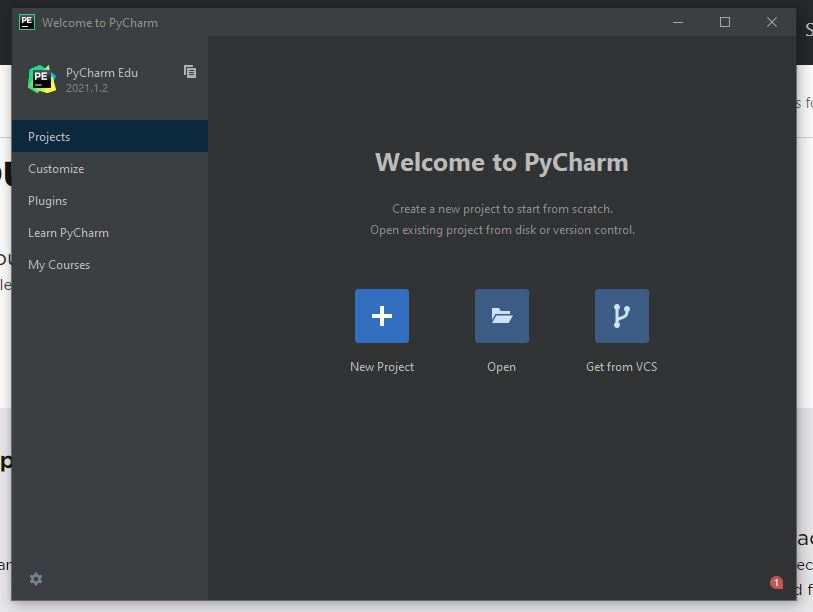
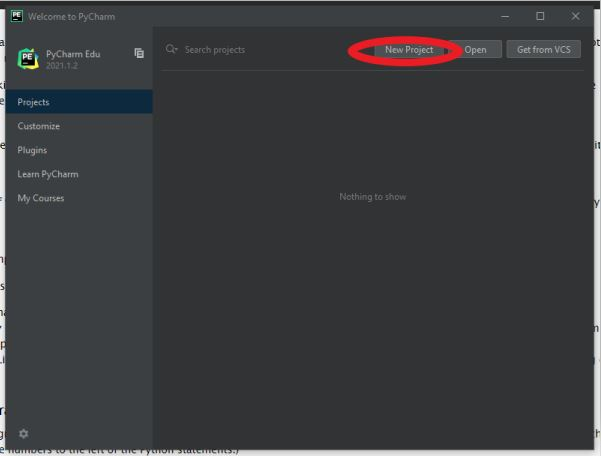
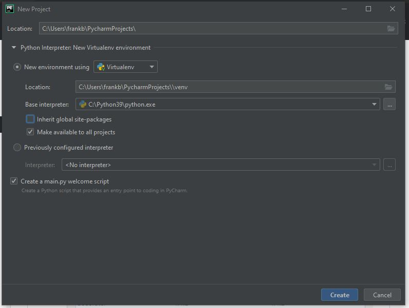

..  Copyright (C)  Jeffrey Elkner, Peter Wentworth, Allen B. Downey, Chris
    Meyers, and Dario Mitchell.  Permission is granted to copy, distribute
    and/or modify this document under the terms of the GNU Free Documentation
    License, Version 1.3 or any later version published by the Free Software
    Foundation; with Invariant Sections being Forward, Prefaces, and
    Contributor List, no Front-Cover Texts, and no Back-Cover Texts.  A copy of
    the license is included in the section entitled "GNU Free Documentation
    License".

Using Python in an IDE
======================

Finding Your IDE
^^^^^^^^^^^^^^^^

There are many different ways to us Python and other languages on a computer.
For this example, we will be using an IDE called PyCharm, but there are many
other options. A few of the IDEs you can use are listed below. IDE stands for 
"Integrated Development Environment." Most good IDEs will consist of a 
**source code editor** that will let you write and manipulate the code, a 
**debugger** to help the user identify and solve issues within the code, and 
a **compiler** that translates your low-level code to high-level code or even 
binary to optimize the performance of your code.

- https://www.jetbrains.com/edu-products/download/#section=pycharm-edu (This is
    the IDE that will be shown here for the example, but we encourage you to try 
    different ones and find the one that suits you.)

- https://www.eclipse.org/; http://pydev.org/ (Eclipse in an IDE for multiple 
    different platforms/languages and pydev is a plug-in to use Python on Eclipse.)

- https://visualstudio.microsoft.com/vs/community/ (Visual Studio Community is 
    a very flexible and modular IDE with great debugging tools.)

If you would like to browse through even more options, there are many others you 
can choose from!

Downloading Your IDE
^^^^^^^^^^^^^^^^^^^^

Each download may look different, but here is the general install proccess for 
PyCharm:

.. figure:: Figures/setup_page_01.JPG
    :align: center
    :alt: This is a screenshot of the opening page to the PyCharm IDE Setup manager.

    Figure 1

Save your install in a path that best works for you. Here we will save it in the 
default path.
    
.. figure:: Figures/setup_page_02.JPG
    :align: center
    :alt: This is a screenshot of how to choose the destination folder for the PyCharm IDE Setup manager.

    Figure 2

Select the installments that word best for your computer. Here, the selection for 
**Add launchers dir to the PATH** helps the computer to recognized automatically which 
folder should be opened in PyCharm. 

.. figure:: Figures/setup_page_03.JPG
    :align: center
    :alt: This is a screenshot of the different installation options to choose from inside the Setup Manager.

    Figure 3

Only import settings settings to your IDE if you have set them up previously. For new
installs, not importing settings is most likely best.

.. figure:: Figures/IDE_setup_05.JPG
    :align: center
    :alt: This is a screenshot of the Import PyCharm Settings page for the PyCharm Setup Manager.

    Figure 4

Once you have everything up and running, your home screen should looks something similar 
to this!

    Figure 5

The last thing you need to do is to configure your interpreter that will be used in your 
IDE. While some downloads will automatically configure this for you, PyCharm needs the 
interpreter to be configured after opening your first repo. If you have a repo you would 
like to clone, then press on **New Project** and then navigate to the options for
**Base Interpreter** and select the file path that your saved your Interpreter in with your
download. Here, clicking **Make available to all projects** will set the base options for all
new projects to use this Interpreter.

    Figure 6

    Figure 7

If you already have a repo on your local computer and would like to set up the interpreter from
there, you can navigate to **File** -> **Settings** -> **Project <project name>** -> 
**Python Interpreter**

.. figure:: Figures/using_IDE_15.JPG
    :align: center
    :alt: This is a screenshot of the setting page while already inside a project for the Pycharm IDE.

    Figure 8

Using an IDE
^^^^^^^^^^^^

Now you are ready to code in an IDE, just make sure you find the ways that your IDE uses to
save, add, pull, commit, and push your work. For instance, in Pycharm, you can right click on 
the code. From there, you can Run the code, Debug the code, use the Git option to add, commit, 
and push your work, and so much more Playing around with it and figuring out new things is the
best part!

.. figure:: Figures/using_IDE_10.PNG
    :align: center
    :alt: This is a screenshot of the context menu inside the Pycharm IDE.

    Figure 9

Debugging with an IDE
^^^^^^^^^^^^^^^^^^^^^

Using an IDE with a debugger and knowing how to use it is a powerful tool. It 
makes usually debugging much easier to manage because it has tools to “step” 
through the code to run your code line by line. It’s very similar to running 
your code through Python Tutor, which is a free online tool that helps you 
understand what happens in every single line of code.

Keep in mind that most IDEs will look a little different in tools, but they 
will have mostly similar tools, like the debugging button.

In PyCharm, your debugging tool will look like this:

.. figure:: Figures/debug.PNG
    :align: center
    :alt: This is a screenshot of the debug button at the tope of the PyCharm IDE.

    Figure 10

For more information on PyCharm debugging, you can follow ‘this link
<https://www.jetbrains.com/help/pycharm/part-1-debugging-python-code.html#step>__’.
Your debugging button will give you options for more tools, like “step-through”, 
which allows you to go through the code line by line. This usually allows for 
easier error-finding.

Breakpoints allow you to set a point where the code stops executing. Doing this 
helps section off the code to make sure it functions. Note that breakpoints can 
be added at any time of the debugging process.

If errors display in the console, they will let you know which line is the source 
of your troubles, usually at the end of the errors list. Some code or descriptor is 
given to help you fix the issue, but sometimes they are cryptic.

.. figure:: Figures/script_vs_console.JPG
    :align: center
    :alt: This is a screenshot of the Console and scrip editor of the Pycharm IDE with a successful repo opened inside.

    Figure 11

Remember that when coding, the console is different from the script. The console 
can display results and you can type line-by-line code. It will remember while you’re 
in the IDE, but you can’t save it the way you can save scripts. Above you will see
the difference between where the script and console is normally on an IDE. When you
run a program, it will only compile everything on the script and run that, not what is 
on the console.

Working directly in the interpreter is convenient for testing short bits of code 
because you get immediate feedback. Think of it as scratch paper used to help you 
work out problems. Anything longer than a few lines should be put into a script.

