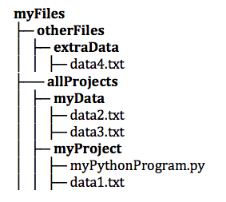

..  Copyright (C)  Brad Miller, David Ranum, Jeffrey Elkner, Peter Wentworth, Allen B. Downey, Chris
    Meyers, and Dario Mitchell.  Permission is granted to copy, distribute
    and/or modify this document under the terms of the GNU Free Documentation
    License, Version 1.3 or any later version published by the Free Software
    Foundation; with Invariant Sections being Forward, Prefaces, and
    Contributor List, no Front-Cover Texts, and no Back-Cover Texts.  A copy of
    the license is included in the section entitled "GNU Free Documentation
    License".

.. qnum::
   :prefix: file-1-
   :start: 1

Finding a File on your Disk
~~~~~~~~~~~~~~~~~~~~~~~~~~~

Opening a file requires that you, as a programmer, and Python agree about the
location of the file on your disk.  The way that files are located on disk is
by their **path**  You can think of the filename as the short name for a file,
and the path as the full name.  For example on a Mac if you save the file
``hello.txt`` in your home directory the path to that file is
``/Users/yourname/hello.txt``  On a Windows machine the path looks a bit different
but the same principles are in use.  For example on windows the path might be
``C:\Users\yourname\My Documents\hello.txt``

.. note:: 

   **The History of Path Separators**

   Why is the path separator a ``/`` on Unix/Linux/MacOS systems and ``\`` on
   Microsoft Windows systems? The concept of a hierarchy of folders
   was first developed in Unix. On a Unix command line a :code:`/` is used to
   separate folder names in a file path and dashes are used to specify command line
   options, e.g.,  ``path/to/file/myfile -long -reverse``. On a
   Windows system the ``/`` character is used for command line options, so the designers
   of Windows decided to use the ``\`` for separating folder names in a file
   path, e.g., ``path\to\file\myfile /long /reverse``. Using a
   ``\`` to separate folder names in a path is problematic because the ``\``
   character is also used as an escape character for special characters, such
   as ``\n`` for a new line character. Bottom line, we will always use the ``/``
   character to separate folder names in a path, and even on Windows
   system the file path will work just fine.

.. index:: absolute file path, relative file path

You can access files in sub-folders, also called directories, under your home directory
by adding a slash and the name of the folder.  For example, if you had a file
called ``hello.py`` in a folder called ``CS150`` that is inside a folder called
``PyCharmProjects`` under your home directory, then the full name for the file
``hello.py`` is ``/Users/yourname/PyCharmProjects/CS150/hello.py``.
This is called an *absolute file path*. An *absolute file path* typically
only works on a specific computer. Think about it for a second. What other
computer in the world is going to have an *absolute file path* that starts with
``/Users/yourname``?

If a file is not in the same folder as your python program, you need to tell
the computer how to reach it. A *relative file path* starts from the folder
that contains your python program and follows a computer's file hierarchy. A
file hierarchy contains folders which contains files and other sub-folders.
Specifying a sub-folder is easy -- you simply specify the sub-folder's name.
To specify a *parent* folder you use the special ``..`` notation because every file
and folder has one unique parent. You can use the ``..``
notation multiple times in a file path to move multiple levels up a file
hierarchy. Here is an example file hierarchy that contains multiple folders,
files, and sub-folders. Folders in the diagram are displayed in **bold** type.

Using the example file hierarchy above, the program, ``myPythonProgram.py``
could access each of the data files using the following *relative file paths*:

* ``data1.txt``
* ``../myData/data2.txt``
* ``../myData/data3.txt``
* ``../../otherFiles/extraData/data4.txt``

Here's the important rule to remember: If your file and your Python program are
in the same directory you can simply use the filename like this:
``open('myfile.txt', 'r')``. If your file and your Python program are in
different directories then you must refer to one or more directories, 
either in a *relative file path* to the file
like this: ``open('../myData/data3.txt', 'r')``, or in an *absolute file path* like
``open('/users/bmiller/myFiles/allProjects/myData/data3.txt', 'r')``.

