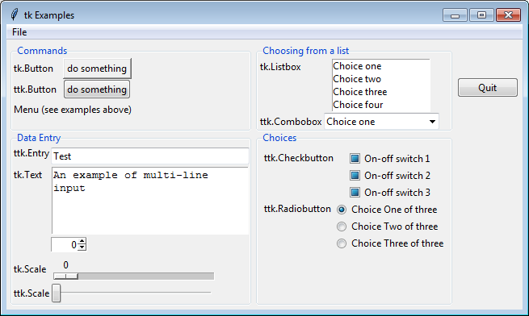

..  Copyright (C)  Brad Miller, David Ranum, Jeffrey Elkner, Peter Wentworth, Allen B. Downey, Chris
    Meyers, and Dario Mitchell.  Permission is granted to copy, distribute
    and/or modify this document under the terms of the GNU Free Documentation
    License, Version 1.3 or any later version published by the Free Software
    Foundation; with Invariant Sections being Forward, Prefaces, and
    Contributor List, no Front-Cover Texts, and no Back-Cover Texts.  A copy of
    the license is included in the section entitled "GNU Free Documentation
    License".

.. qnum::
   :prefix: gui-3-
   :start: 1

GUI Widgets
===========

As we discussed in the introduction, a GUI program allows a user
to interact with a computer program using a pointing device that manipulates
small pictures called ``icons`` or ``widgets``. The first task of a GUI
program is to create the widgets needed for a program's interface. Each widget
is designed for specific purposes and your program will be more
user friendly if you use each widget according to its intended purpose.

Widgets are basically images on a computer screen and they have a
"look-and-feel" depending on the details of how the image is drawn.
The "look-and-feel" of a widget is typically controlled by the operating system.
For example, GUI programs on a Macintosh computer typically look different from
programs on a Microsoft Windows computer. The ``tkinter`` module implements
two versions of widgets: one is "generic," which makes widgets look the same
regardless of what computer your program is running on, and the other
implements widgets that emulate a computer's "look-and-feel".
How you import the ``tkinter`` module determines which widgets are defined.
Using the import statements shown below, the standard convention uses the
name ``tk`` to access the "generic" widgets and the name ``ttk`` to access
the stylized, "look-and-feel" widgets. You always need to import the
``tk`` functionality because that allows you to create an application
window. You can import the ``ttk`` functionality if you want "look-and-feel"
widgets. You can inter-mix the ``tk`` and ``ttk`` widgets in an interface
if you so choose.

.. code-block:: python

  # To use the "generic" widgets
  import tkinter as tk

  # To use the stylized, "look-and-feel" widgets
  from tkinter import ttk

The following two charts list the standard, pre-defined widgets in the
``tkinter`` module.

The following widgets are used for user input. In some cases you have a
choice between the ``tk`` and ``ttk`` versions. In other cases you must
use the ``tk`` version because the equivalent ``ttk`` versions don't exist.

=======================================  ==============================================================
Widget                                   Purpose
=======================================  ==============================================================
``tk.Button``, ``ttk.Button``            Execute a specific task; a “do this now” command.
``tk.Menu``                              Implements toplevel, pulldown, and popup menus.
``ttk.Menubutton``                       Displays popup or pulldown menu items when activated.
``tk.OptionMenu``                        Creates a popup menu, and a button to display it.
``tk.Entry``, ``ttk.Entry``              Enter one line of text.
``tk.Text``                              Display and edit formatted text, possibly with multiple lines.
``tk.Checkbutton``, ``ttk.Checkbutton``  Set on-off, True-False selections.
``tk.Radiobutton``, ``ttk.Radiobutton``  Allow one-of-many selections.
``tk.Listbox``                           Choose one or more alternatives from a list.
``ttk.Combobox``                         Combines a text field with a pop-down list of values.
``tk.Scale``, ``ttk.Scale``              Select a numerical value by moving a “slider” along a scale.
=======================================  ==============================================================

The following figure shows examples of these widgets. You can download
and run this python program, `all_user_input_widgets.py`_, to interact with the widgets.

  Examples of user input widgets

The following ``widgets`` display information to a user, but have no user interaction:

============================  ================================================
Widget                        Purpose
============================  ================================================
``tk.Label``, ``ttk.Label``   Display static text or an image.
``tk.Message``                Display static multi-line text.
``ttk.Separator``             Displays a horizontal or vertical separator bar.
``ttk.Progressbar``           Shows the status of a long-running operation.
``ttk.Treeview``              Displays a hierarchical collection of items.
============================  ================================================

You do not need to memorize the above lists, but you should probably re-read
the lists again so that you are familiar with what is possible in a
TKinter GUI interface. (Note that the TKinter module is customizable, which
means that you can create your own widgets, but that is beyond what we will
study in these lessons.)

Creating Widgets
================

After importing the Tkinter modules as shown above, the first thing you
need to do is create a window for your application. This is done by
creating a ``Tk`` object:

.. code-block:: python

  application_window = tk.Tk()

Then you create widgets and add them to the window's widget
hierarchy. For example, to create a button you would call either the
``tk`` or the ``ttk`` ``Button`` method and send the ``application_window``
as the first argument:

.. code-block:: python

  cmd_button = tk.Button(application_window, text="Example")
  # or
  cmd_button = ttk.Button(application_window, text="Example")

The parameters needed to correctly create each widget varies, so you will need to
refer to the Python documentation for each specific widget type. As of fall
2016, the most current version of the Tkinter module is version 25 and its
documentation can be found at https://docs.python.org/3/library/tk.html

Notice that in the above code, ``Tk()`` and ``Button()`` are both capitalized.
By convention, this indicates that the window and the button are instances
of a Python class. The Tkinter module is entirely object-oriented and makes
extensive use of object-oriented language features.

.. index:: Tkinter, widget, widget hierarchy, Button, Menu, MenuButton, OptionMenu,
           Entry, Text, Checkbutton, Radiobutton, Listbox, Combobox, Scale,
           Label, Message, Separator, Progressbar, Treeview

.. _all_user_input_widgets.py: ../_static/Programs/all_user_input_widgets.py
