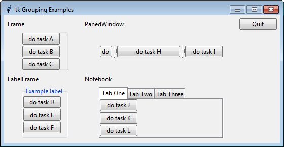

..  Copyright (C)  Brad Miller, David Ranum, Jeffrey Elkner, Peter Wentworth, Allen B. Downey, Chris
    Meyers, and Dario Mitchell.  Permission is granted to copy, distribute
    and/or modify this document under the terms of the GNU Free Documentation
    License, Version 1.3 or any later version published by the Free Software
    Foundation; with Invariant Sections being Forward, Prefaces, and
    Contributor List, no Front-Cover Texts, and no Back-Cover Texts.  A copy of
    the license is included in the section entitled "GNU Free Documentation
    License".

.. qnum::
   :prefix: gui-5-
   :start: 1

Widget Groupings
================

You will design a more user friendly interface if you group and organize
your widgets in a coherent design. Tkinter has four basic ways to group
widgets. These are described in the following table. They are often referred
to as "container" widgets because in the widget hierarchy of a GUI program
they are the parent widget of a group of related widgets.

============================  =============================================================================
Widget                        Purpose
============================  =============================================================================
``tk.Frame``, ``ttk.Frame``   Create a container for a set of widgets to be displayed as a unit.
``ttk.LabelFrame``            Group a number of related widgets using a border and a title.
``tk.PanedWindow``            Group one or more widgets into “panes”, where the "panes"
                              can be re-sized by the user by dragging separator lines.
``ttk.Notebook``              A tabbed set of frames, only one of which is visible at any given time.
============================  =============================================================================

Widgets are always organized as a hierarchy, where the main
application window is the root of the hierarchy. Typically, the child widgets
of an application window are a combination of "frames". The "frames" hold
other widgets. A "frame" will not be visible until it is assigned a size
and location using a layout manager. The image below shows examples of the
four types of widget "containers". The "containers" in this example used a
``grid`` layout manager on a 2x2 grid.

  Examples of grouping widgets

For the ``Frame`` and ``LabelFrame`` groups, the frame is the "parent" of the
widgets displayed inside the frame. That is, when the buttons were created,
the frame was the first parameter to the ``tk.Button()`` function.

For the ``PanedWindow`` and ``Notebook`` groups, you use an ``.add(widget)``
function to add your widgets to the group. You are still creating a hierarchy
of widgets, but the syntax is different.

You can download and run this example program, `all_frame_widgets.py`_ that allows you to interact
with the four types of "contaners."

.. index:: Tkinter, widget, widget hierarchy, Frame, LabelFrame, PanedWindow, Notebook

.. _all_frame_widgets.py: ../_static/Programs/all_frame_widgets.py
