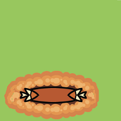

..  Copyright (C)  Brad Miller, David Ranum, Jeffrey Elkner, Peter Wentworth, Allen B. Downey, Chris
    Meyers, and Dario Mitchell.  Permission is granted to copy, distribute
    and/or modify this document under the terms of the GNU Free Documentation
    License, Version 1.3 or any later version published by the Free Software
    Foundation; with Invariant Sections being Forward, Prefaces, and
    Contributor List, no Front-Cover Texts, and no Back-Cover Texts.  A copy of
    the license is included in the section entitled "GNU Free Documentation
    License".

.. qnum::
   :prefix: gui-10-
   :start: 1

A Programming Example
=====================

Let's develop a non-trivial GUI program to demonstrate the material presented
in the previous lessons. We will develop a GUI Whack-a-mole
game where a user tries to click on "moles" as they randomly pop up out of
the "ground."

This discussion will take you through an *incremental development* cycle
that creates a program in well-defined stages. While you might read a
finished computer program from "top to bottom," that is not how it was
developed. For a typical GUI program development, you are encouraged to go
through these stages:

#. Using scratch paper, physically draw a rough sketch of your user interface.
#. Create the basic structure of your program and create the major frames that
   will hold the widgets needed for your program's interface. Give the frames
   an initial size and color so that you can visually see them, given that
   there are no widgets inside of them to determine their size.
#. Incrementally add all of the widgets you need for your program and size and
   position them appropriately.
#. Create your callback functions, stub them out, and assign them to appropriate
   events. Verify that the events are executing the correct functions.
#. Incrementally implement the functionality needed for each callback function.

When you develop code using *incremental development* your program should
always be executable. You continually add a few lines of code and then test
them. If errors occur you almost always know were the errors came from!
They came from the lines of code you just added.

A Whack-a-mole Game
-------------------

Step 1: Make sure you have a reasonable GUI design and implementation plan
before you start coding. Draw a sketch of your initial design on paper
and consider how a user will interact with your program.

.. figure:: Figures/Whack_a_mole_design.png
  :align: center

  Initial design of a Whack-a-mole game

Step 2: Create the basic structure of your interface using appropriate ``frame``
widgets. You will need to give a size to the frames because they will contain
no widgets, which is how a frame typically gets its size. It is also suggested
that you give each frame a unique color so it is easy to see the area of the
window it covers. Here is a basic start for our whack-a-mole game (`whack_a_mole_v1.py`_):

.. code-block:: python

  def main():
      # Create the entire GUI program
      program = WhackAMole()

      # Start the GUI event loop
      program.window.mainloop()

  class WhackAMole:

      def __init__(self):
          self.window = tk.Tk()
          self.mole_frame, self.status_frame = self.create_frames()

      def create_frames(self):
          mole_frame = tk.Frame(self.window, bg='red', width=300, height=300)
          mole_frame.grid(row=1, column=1)

          status_frame = tk.Frame(self.window, bg='green', width=100, height=300)
          status_frame.grid(row=1, column=2)

          return mole_frame, status_frame

  if __name__ == "__main__":
      main()

Step 3: Incrementally add appropriate widgets to each frame. Don't attempt
to add all the widgets at once. The initial design conceptualized the moles
as buttons, so a grid of buttons was added to the left frame, one button
for each mole. The exact size of the "mole field" needs to be determined at
a future time, so initialize a CONSTANT that can be used to easily change it
later.  (`whack_a_mole_v2.py`_)

.. image:: Figures/mole.png

.. code-block:: python

  import tkinter as tk
  from tkinter import PhotoImage

  def main():
      # Create the entire GUI program
      program = WhackAMole()

      # Start the GUI event loop
      program.window.mainloop()

  class WhackAMole:
      NUM_MOLES_ACROSS = 4

      def __init__(self):
          self.window = tk.Tk()
          self.mole_frame, self.status_frame = self.create_frames()
          self.mole_photo = PhotoImage(file="mole.png")
          self.mole_buttons = self.create_moles()

      def create_frames(self):
          mole_frame = tk.Frame(self.window, bg='red')
          mole_frame.grid(row=1, column=1)

          status_frame = tk.Frame(self.window, bg='green', width=100)
          status_frame.grid(row=1, column=2, sticky=tk.E + tk.W + tk.N + tk.S)

          return mole_frame, status_frame

      def create_moles(self):
          # Source of mole image: https://play.google.com/store/apps/details?id=genergame.molehammer

          mole_buttons = []
          for r in range(WhackAMole.NUM_MOLES_ACROSS):
              row_of_buttons = []
              for c in range(WhackAMole.NUM_MOLES_ACROSS):
                  mole_button = tk.Button(self.mole_frame, image=self.mole_photo)
                  mole_button.grid(row=r, column=c, padx=8, pady=8)

                  row_of_buttons.append(mole_button)

              mole_buttons.append(row_of_buttons)

          return mole_buttons

  if __name__ == "__main__":
      main()

Continue to add appropriate widgets for the right frame. The final result is
shown below, but recognize that it was developed little by little.
(`whack_a_mole_v3.py`_)

.. code-block:: python

  import tkinter as tk
  from tkinter import PhotoImage

  def main():
      # Create the entire GUI program
      program = WhackAMole()

      # Start the GUI event loop
      program.window.mainloop()

  class WhackAMole:
      STATUS_BACKGROUND = "white"
      NUM_MOLES_ACROSS = 4

      def __init__(self):
          self.window = tk.Tk()
          self.mole_frame, self.status_frame = self.create_frames()
          self.mole_photo = PhotoImage(file="mole.png")
          self.mole_buttons = self.create_moles()

          self.hit_counter, self.miss_counter, self.start_button \
              = self.create_status_widgets()

      def create_frames(self):
          mole_frame = tk.Frame(self.window, bg='red')
          mole_frame.grid(row=1, column=1)

          status_frame = tk.Frame(self.window, bg=WhackAMole.STATUS_BACKGROUND)
          status_frame.grid(row=1, column=2, sticky=tk.N + tk.S + tk.W + tk.W)

          return mole_frame, status_frame

      def create_moles(self):
          # Source of mole image: https://play.google.com/store/apps/details?id=genergame.molehammer

          mole_buttons = []
          for r in range(WhackAMole.NUM_MOLES_ACROSS):
              row_of_buttons = []
              for c in range(WhackAMole.NUM_MOLES_ACROSS):
                  mole_button = tk.Button(self.mole_frame, image=self.mole_photo)
                  mole_button.grid(row=r, column=c, padx=8, pady=8)

                  row_of_buttons.append(mole_button)

              mole_buttons.append(row_of_buttons)

          return mole_buttons

      def create_status_widgets(self):
          spacer = tk.Label(self.status_frame, text="", bg=WhackAMole.STATUS_BACKGROUND)
          spacer.pack(side="top", fill=tk.Y, expand=True)

          hit_label = tk.Label(self.status_frame, text="Number of Hits", bg=WhackAMole.STATUS_BACKGROUND)
          hit_label.pack(side="top", fill=tk.Y, expand=True)

          hit_counter = tk.Label(self.status_frame, text="0", bg=WhackAMole.STATUS_BACKGROUND)
          hit_counter.pack(side="top", fill=tk.Y, expand=True)

          spacer = tk.Label(self.status_frame, text="", bg=WhackAMole.STATUS_BACKGROUND)
          spacer.pack(side="top", fill=tk.Y, expand=True)

          miss_label = tk.Label(self.status_frame, text="Number of Misses", bg=WhackAMole.STATUS_BACKGROUND)
          miss_label.pack(side="top", fill=tk.Y, expand=True)

          miss_counter = tk.Label(self.status_frame, text="0", bg=WhackAMole.STATUS_BACKGROUND)
          miss_counter.pack(side="top", fill=tk.Y, expand=True)

          spacer = tk.Label(self.status_frame, text="", bg=WhackAMole.STATUS_BACKGROUND)
          spacer.pack(side="top", fill=tk.Y, expand=True)

          start_button = tk.Button(self.status_frame, text="Start")
          start_button.pack(side="top", fill=tk.Y, expand=True, ipadx=10)

          spacer = tk.Label(self.status_frame, text="", bg=WhackAMole.STATUS_BACKGROUND)
          spacer.pack(side="top", fill=tk.Y, expand=True)

          quit_button = tk.Button(self.status_frame, text="Quit")
          quit_button.pack(side="top", fill=tk.Y, expand=True, ipadx=10)

          spacer = tk.Label(self.status_frame, text="", bg=WhackAMole.STATUS_BACKGROUND)
          spacer.pack(side="top", fill=tk.Y, expand=True)

          return hit_counter, miss_counter, start_button

  if __name__ == "__main__":
      main()

Step 4: Create a callback function for each event that will cause something
to happen in your program. Stub these functions out with a single print
statement in each one. Bind an event to each callback function. Now test
your program and make sure each event causes the correct print-line in
the Python console. (`whack_a_mole_v4.py`_)

.. code-block:: python

  import tkinter as tk
  from tkinter import PhotoImage

  def main():
      # Create the entire GUI program
      program = WhackAMole()

      # Start the GUI event loop
      program.window.mainloop()

  class WhackAMole():
      STATUS_BACKGROUND = "white"
      NUM_MOLES_ACROSS = 4

      def __init__(self):
          self.window = tk.Tk()
          self.mole_frame, self.status_frame = self.create_frames()
          self.mole_photo = PhotoImage(file="mole.png")
          self.mole_buttons = self.create_moles()

          self.hit_counter, self.miss_counter, self.start_button, self.quit_button \
              = self.create_status_widgets()

          self.set_callbacks()

      def create_frames(self):
          mole_frame = tk.Frame(self.window, bg='red')
          mole_frame.grid(row=1, column=1)

          status_frame = tk.Frame(self.window, bg=WhackAMole.STATUS_BACKGROUND)
          status_frame.grid(row=1, column=2, sticky=tk.E + tk.W + tk.N + tk.S)

          return mole_frame, status_frame

      def create_moles(self):
          # Source of mole image: https://play.google.com/store/apps/details?id=genergame.molehammer

          mole_buttons = []
          for r in range(WhackAMole.NUM_MOLES_ACROSS):
              row_of_buttons = []
              for c in range(WhackAMole.NUM_MOLES_ACROSS):
                  mole_button = tk.Button(self.mole_frame, image=self.mole_photo)
                  mole_button.grid(row=r, column=c, padx=8, pady=8)

                  row_of_buttons.append(mole_button)

              mole_buttons.append(row_of_buttons)

          return mole_buttons

      def create_status_widgets(self):
          spacer = tk.Label(self.status_frame, text="", bg=WhackAMole.STATUS_BACKGROUND)
          spacer.pack(side="top", fill=tk.Y, expand=True)

          hit_label = tk.Label(self.status_frame, text="Number of Hits", bg=WhackAMole.STATUS_BACKGROUND)
          hit_label.pack(side="top", fill=tk.Y, expand=True)

          hit_counter = tk.Label(self.status_frame, text="0", bg=WhackAMole.STATUS_BACKGROUND)
          hit_counter.pack(side="top", fill=tk.Y, expand=True)

          spacer = tk.Label(self.status_frame, text="", bg=WhackAMole.STATUS_BACKGROUND)
          spacer.pack(side="top", fill=tk.Y, expand=True)

          miss_label = tk.Label(self.status_frame, text="Number of Misses", bg=WhackAMole.STATUS_BACKGROUND)
          miss_label.pack(side="top", fill=tk.Y, expand=True)

          miss_counter = tk.Label(self.status_frame, text="0", bg=WhackAMole.STATUS_BACKGROUND)
          miss_counter.pack(side="top", fill=tk.Y, expand=True)

          spacer = tk.Label(self.status_frame, text="", bg=WhackAMole.STATUS_BACKGROUND)
          spacer.pack(side="top", fill=tk.Y, expand=True)

          start_button = tk.Button(self.status_frame, text="Start")
          start_button.pack(side="top", fill=tk.Y, expand=True, ipadx=10)

          spacer = tk.Label(self.status_frame, text="", bg=WhackAMole.STATUS_BACKGROUND)
          spacer.pack(side="top", fill=tk.Y, expand=True)

          quit_button = tk.Button(self.status_frame, text="Quit")
          quit_button.pack(side="top", fill=tk.Y, expand=True, ipadx=10)

          spacer = tk.Label(self.status_frame, text="", bg=WhackAMole.STATUS_BACKGROUND)
          spacer.pack(side="top", fill=tk.Y, expand=True)

          return hit_counter, miss_counter, start_button, quit_button

      def set_callbacks(self):
          # Set the same callback for each mole button
          for r in range(WhackAMole.NUM_MOLES_ACROSS):
              for c in range(WhackAMole.NUM_MOLES_ACROSS):
                  self.mole_buttons[r][c]['command'] = self.mole_hit

          self.start_button['command'] = self.start
          self.quit_button['command'] = self.quit

      def mole_hit(self):
          print("mole button hit")

      def start(self):
          print("start button hit")

      def quit(self):
          print("quit button hit")

  if __name__ == "__main__":
      main()

Step 5: Add appropriate functionality to the callback functions. This is
where the functional logic of your particular application resides. In the
case of our whack-a-mole game, we need to be able to count the number of
times a user clicks on a mole when it is visible. And we need the moles to
appear and disappear at random intervals. Originally each mole was a
button widget, but the border around each button was distracting, so
they were changed to label widgets. Two images were used to represent a mole:
one image is a solid color that matches the frame's background, and the
other image is a picture of a mole. By replacing the image used for each
label we can make the moles visible or invisible. A label normally does
not have an associated callback, so we ``bind`` a left mouse click
event, ``"<ButtonPress-1>"`` to each label. We can determine whether
the mouse click is a "hit" or a "miss" by examining the label under the
click to see which image is currently set to the label. We use timer
events to change the image on each label.
Also notice the use of a messagebox to protect the program from accidental
quitting. The end result is shown below. (`whack_a_mole_v5.py`_)

.. code-block:: python

  import tkinter as tk
  from tkinter import PhotoImage
  from tkinter import messagebox
  from random import randint

  def main():
      # Create the entire GUI program
      program = WhackAMole()

      # Start the GUI event loop
      program.window.mainloop()

  class WhackAMole:
      STATUS_BACKGROUND = "white"
      NUM_MOLES_ACROSS = 4
      MIN_TIME_DOWN = 1000
      MAX_TIME_DOWN = 5000
      MIN_TIME_UP = 1000
      MAX_TIME_UP = 3000

      def __init__(self):
          self.window = tk.Tk()
          self.window.title("Whack-a-mole")

          self.mole_frame, self.status_frame = self.create_frames()

          self.mole_photo = PhotoImage(file="mole.png")
          self.mole_cover_photo = PhotoImage(file="mole_cover.png")
          self.label_timers = {}

          self.mole_labels = self.create_moles()

          self.hit_counter, self.miss_counter, self.start_button, self.quit_button \
              = self.create_status_widgets()

          self.set_callbacks()
          self.game_is_running = False

      def create_frames(self):
          mole_frame = tk.Frame(self.window)
          mole_frame.grid(row=0, column=0)

          status_frame = tk.Frame(self.window, bg=WhackAMole.STATUS_BACKGROUND)
          status_frame.grid(row=0, column=1, sticky=tk.E + tk.W + tk.N + tk.S,
                            ipadx=6)

          return mole_frame, status_frame

      def create_moles(self):
          # Source of mole image: https://play.google.com/store/apps/details?id=genergame.molehammer

          mole_labels = []
          for r in range(WhackAMole.NUM_MOLES_ACROSS):
              row_of_labels = []
              for c in range(WhackAMole.NUM_MOLES_ACROSS):
                  mole_label = tk.Label(self.mole_frame, image=self.mole_photo)
                  mole_label.grid(row=r, column=c, sticky=tk.E + tk.W + tk.N + tk.S)
                  self.label_timers[id(mole_label)] = None

                  row_of_labels.append(mole_label)

              mole_labels.append(row_of_labels)

          return mole_labels

      def create_status_widgets(self):
          spacer = tk.Label(self.status_frame, text="",
                            bg=WhackAMole.STATUS_BACKGROUND)
          spacer.pack(side="top", fill=tk.Y, expand=True)

          hit_label = tk.Label(self.status_frame, text="Number of Hits",
                               bg=WhackAMole.STATUS_BACKGROUND)
          hit_label.pack(side="top", fill=tk.Y, expand=True)

          hit_counter = tk.Label(self.status_frame, text="0",
                                 bg=WhackAMole.STATUS_BACKGROUND)
          hit_counter.pack(side="top", fill=tk.Y, expand=True)

          spacer = tk.Label(self.status_frame, text="",
                            bg=WhackAMole.STATUS_BACKGROUND)
          spacer.pack(side="top", fill=tk.Y, expand=True)

          miss_label = tk.Label(self.status_frame, text="Number of Misses",
                                bg=WhackAMole.STATUS_BACKGROUND)
          miss_label.pack(side="top", fill=tk.Y, expand=True)

          miss_counter = tk.Label(self.status_frame, text="0",
                                  bg=WhackAMole.STATUS_BACKGROUND)
          miss_counter.pack(side="top", fill=tk.Y, expand=True)

          spacer = tk.Label(self.status_frame, text="",
                            bg=WhackAMole.STATUS_BACKGROUND)
          spacer.pack(side="top", fill=tk.Y, expand=True)

          start_button = tk.Button(self.status_frame, text="Start")
          start_button.pack(side="top", fill=tk.Y, expand=True, ipadx=10)

          spacer = tk.Label(self.status_frame, text="",
                            bg=WhackAMole.STATUS_BACKGROUND)
          spacer.pack(side="top", fill=tk.Y, expand=True)

          quit_button = tk.Button(self.status_frame, text="Quit")
          quit_button.pack(side="top", fill=tk.Y, expand=True, ipadx=10)

          spacer = tk.Label(self.status_frame, text="",
                            bg=WhackAMole.STATUS_BACKGROUND)
          spacer.pack(side="top", fill=tk.Y, expand=True)

          return hit_counter, miss_counter, start_button, quit_button

      def set_callbacks(self):
          # Set the same callback for each mole label
          for r in range(WhackAMole.NUM_MOLES_ACROSS):
              for c in range(WhackAMole.NUM_MOLES_ACROSS):
                  self.mole_labels[r][c].bind("<ButtonPress-1>", self.mole_hit)

          self.start_button['command'] = self.start
          self.quit_button['command'] = self.quit

      def mole_hit(self, event):

          if self.game_is_running:
              hit_label = event.widget
              if hit_label['image'] == self.mole_cover_photo.name:
                  # MISSED! Update the miss counter
                  self.miss_counter['text'] = str(int(self.miss_counter['text']) + 1)
              else:
                  # HIT! Update the hit counter
                  self.hit_counter['text'] = str(int(self.hit_counter['text']) + 1)
                  # Remove the mole and don't update the miss counter
                  self.put_down_mole(hit_label, False)

      def start(self):
          if self.start_button['text'] == 'Start':
              # Change all the mole images to a blank image and
              # set a random time for the moles to re-appear on each label.
              for r in range(WhackAMole.NUM_MOLES_ACROSS):
                  for c in range(WhackAMole.NUM_MOLES_ACROSS):
                      the_label = self.mole_labels[r][c]
                      the_label['image'] = self.mole_cover_photo
                      time_down = randint(WhackAMole.MIN_TIME_DOWN,
                                          WhackAMole.MAX_TIME_DOWN)
                      timer_object = the_label.after(time_down,
                                                     self.pop_up_mole, the_label)
                      self.label_timers[id(the_label)] = timer_object

              self.game_is_running = True
              self.start_button['text'] = "Stop"

              self.hit_counter['text'] = "0"
              self.miss_counter['text'] = "0"

          else:  # The game is running, so stop the game and reset everything
              # Show every mole and stop all the timers
              for r in range(WhackAMole.NUM_MOLES_ACROSS):
                  for c in range(WhackAMole.NUM_MOLES_ACROSS):
                      the_label = self.mole_labels[r][c]
                      # Show the mole
                      the_label['image'] = self.mole_photo
                      # Delete any timer that is associated with the mole
                      the_label.after_cancel(self.label_timers[id(the_label)])

              self.game_is_running = False
              self.start_button['text'] = "Start"

      def put_down_mole(self, the_label, timer_expired):

          if self.game_is_running:
              if timer_expired:
                  # The mole is going down before it was clicked on, so update the miss counter
                  self.miss_counter['text'] = str(int(self.miss_counter['text']) + 1)
              else:
                  # The timer did not expire, so manually stop the timer
                  the_label.after_cancel(self.label_timers[id(the_label)])

              # Make the mole invisible
              the_label['image'] = self.mole_cover_photo

              # Set a call to pop up the mole in the future
              time_down = randint(WhackAMole.MIN_TIME_DOWN,
                                  WhackAMole.MAX_TIME_DOWN)
              timer_object = the_label.after(time_down, self.pop_up_mole, the_label)
              # Remember the timer object so it can be canceled later, if need be
              self.label_timers[id(the_label)] = timer_object

      def pop_up_mole(self, the_label):
          # Show the mole on the screen
          the_label['image'] = self.mole_photo

          if self.game_is_running:
              # Set a call to make the mole disappear in the future
              time_up = randint(WhackAMole.MIN_TIME_UP, WhackAMole.MAX_TIME_UP)
              timer_object = the_label.after(time_up, self.put_down_mole,
                                             the_label, True)
              self.label_timers[id(the_label)] = timer_object

      def quit(self):
          really_quit = messagebox.askyesno("Quiting?", "Do you really want to quit?")
          if really_quit:
              self.window.destroy()

  if __name__ == "__main__":
      main()

Summary
-------

We developed a complete GUI application in 5 well-designed stages. Hopefully
you see the value in incremental software development.

However, the end result is not necessarily easy to understand or modify for
future enhancements. The next lesson will introduce a scheme for breaking
complete software into more managable pieces.

.. index:: Whack-a-mole game

.. _whack_a_mole_v1.py: ../_static/Programs/whack_a_mole_v1.py
.. _whack_a_mole_v2.py: ../_static/Programs/whack_a_mole_v2.py
.. _whack_a_mole_v3.py: ../_static/Programs/whack_a_mole_v3.py
.. _whack_a_mole_v4.py: ../_static/Programs/whack_a_mole_v4.py
.. _whack_a_mole_v5.py: ../_static/Programs/whack_a_mole_v5.py

