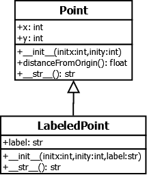
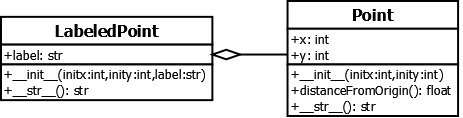

Class Diagrams
--------------

When two classes are involved in an inheritance or composition relationship,
we say that an association exists between them. Often it is helpful to
depict the associations between classes on a graphical diagram, so that
developers working on the code can see at a glance how the classes are
related to each other. The *Unified Modeling Language* (UML) is a graphical
notation that provides a standard for depicting classes and their 
associations on various types of diagrams. It gives software engineers a
way to record both their proposed designs, as well as the design of the
final product. Put another way, UML provides the notation for constructing
blueprints for software, and since it is widely used in both industry and
academia, it is important for you to have some familiarity with it.

UML defines notations for several different kinds of diagrams. Here, we
will introduce class diagrams, one of the most common UML diagrams. Class
diagrams can contain a number of different elements, but we will focus
on the basics: depicting classes with their instance variables and methods,
and relationships to other classes.

On a UML class diagram, a class is depicted as a rectangle with three sections.
The top section contains the class name; the middle section, the instance
variables; and the bottom section, the methods. The following diagram shows
the classes Point and LabeledPoint in their original inheritance relationship. 

   
To depict composition, UML uses a different type of association, 
as shown in this figure:

