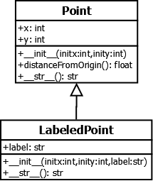

..  Copyright (C)  Stephen Schaub.  Permission is granted to copy, distribute
    and/or modify this document under the terms of the GNU Free Documentation
    License, Version 1.3 or any later version published by the Free Software
    Foundation; with Invariant Sections being Forward, Prefaces, and
    Contributor List, no Front-Cover Texts, and no Back-Cover Texts.  A copy of
    the license is included in the section entitled "GNU Free Documentation
    License".

.. index:: inheritance

Pillars of OOP
--------------

Object-oriented programming involves four key ideas: encapsulation, information 
hiding, inheritance, and polymorphism. **Encapsulation** is the idea that 
a class can package some data together with the methods that manipulate the 
data. This is a powerful capability, and the chief idea that distinguishes OOP 
from structured programming. **Information Hiding** promotes quality 
code by allowing objects to protect their state against direct manipulation by 
code using the object. Python, like many languages, provides mechanisms
to achieve information hiding, but we do not cover them in this book. 
**Inheritance** and **polymorphism** are mechanisms that help to enable 
code reuse and contract-based programming, and are the subject of this chapter.

Introduction to Inheritance
---------------------------

Recall the Point class from earlier in the book:

.. sourcecode:: python

    class Point:
        
        def __init__(self, initX, initY):
            self.x = initX
            self.y = initY
            
        def distanceFromOrigin(self):
            return ((self.x ** 2) + (self.y ** 2)) ** 0.5            

        def __str__(self):
            return "x=" + str(self.x) + ", y=" + str(self.y)
        
    p = Point(7, 6)

Now, suppose we want to create a class that works like ``Point`` 
in every respect, but also keeps track of a short description for the point.
We could create a ``LabeledPoint`` class by copying and pasting the definition for 
``Point``,
changing the name to ``LabeledPoint``, and modifying the class to suit our
purposes. However, any time you copy and paste code, keep in mind that
you are copying and pasting bugs that may exist in the code. Inheritance
provides a way to reuse the definition of Point without having to copy and
paste.

We begin like this:

.. sourcecode:: python

    class LabeledPoint(Point):
        pass

This example defines a class named ``LabeledPoint`` that inherits from the ``Point`` class.
Putting the name ``Point`` in parenthesis tells Python that the new class, 
``LabeledPoint``, begins with all of the methods defined in its parent, ``Point``.
For example, we can instantiate LabeledPoint using the Point constructor, and
invoke any Point methds we want to on it:

.. sourcecode:: python

    p = LabeledPoint(7,6)
    dist = p.distanceFromOrigin()

Now, let's refine LabeledPoint so that it holds a label, along with the x and y 
coordinates:

.. sourcecode:: python
   
    class LabeledPoint(Point):

        def __init__(self, initX, initY, label):
            self.x = initX
            self.y = initY
            self.label = label
            
        def __str__(self):
            return "x=" + str(self.x) + ", y=" + str(self.y) + " (" + self.label + ")"            

    labeledPt = LabeledPoint(7,6,"Here")
    
Here, we have redefined two of the methods that LabeledPoint inherits from Point: 
``__init__()`` and ``__str__()``. 
This is called *overriding*. When a child class redefines methods that are defined
in its parent, we say that the child *overrides* the functionality inherited from
its parent. When both the parent class and child class have a method with the
same name, an invocation of the method on an instance of the child class 
executes code in the child's class; an invocation of the method on an instance
of the parent class executes code in the parent's class. For example,
consider the following:

.. sourcecode:: python
   :linenos:

    pt = Point(5,10)
    labeledPt = LabeledPoint(7, 6, "Here")
    
    ptStr = str(pt)
    labeledPtStr = str(labeledPt)

In Line 4, the call to ``str(pt)`` invokes the ``__str__()`` method in ``Point``, because
pt refers to an instance of ``Point``. In Line 5, the call to ``str(labeledPt)``
invokes the ``__str__()`` method in ``LabeledPoint``, because ``labeledPt``
refers to an instance of ``LabeledPoint``.

Extending 
~~~~~~~~~

If you compare the code in the __init__ methods of ``Point`` and ``LabeledPoint``, you can
see that there is some duplication--the initialization of x and y. We can 
eliminate the duplication by having ``LabeledPoint``'s ``__init__()`` method invoke
``Point``'s ``__init__()`` method. That way, each class will be responsible for 
initializing its own instance variables. 

A method in a child class that overrides a method in the parent can invoke 
the overridden method using ``super()``, like this:

.. sourcecode:: python
   :emphasize-lines: 4
   :linenos:
   
    class LabeledPoint(Point):

        def __init__(self, initX, initY, label):
            super().__init__(initX, initY)
            self.label = label

In this example, line 4 invokes the ``__init__()`` method in ``Point``, 
passing the values of ``initX`` and ``initY``
to be used in initializing the ``x`` and ``y`` instance variables. 

Here is a complete code listing showing both classes, with a version
of ``__str__()`` for ``LabeledPoint`` that invokes its parent's implementation
using ``super()`` to avoid duplicating the functionality provided in ``Point``.

.. activecode:: ch_inh_labeledpoint_extend

    class Point:
        
        def __init__(self, initX, initY):
            self.x = initX
            self.y = initY
            
        def distanceFromOrigin(self):
            return ((self.x ** 2) + (self.y ** 2)) ** 0.5            

        def __str__(self):
            return "x=" + str(self.x) + ", y=" + str(self.y)

    class LabeledPoint(Point):

        def __init__(self, initX, initY, label):
            super().__init__(initX, initY)
            self.label = label
            
        def __str__(self):
            return super().__str__() + " (" + self.label + ")"            

    p = LabeledPoint(7,6,"Here")
    print(p)
    print(p.distanceFromOrigin())

Reuse Through Composition
-------------------------

Inheritance is not the only way to reuse code. *Composition* occurs when
an object stores a reference to one or more objects in one of its instance
variables. The object is thus able to reuse code in the objects it 
embeds within itself.

For example, our LabeledPoint example could have been implemented as follows:

.. sourcecode:: python

    class LabeledPoint:

        def __init__(self, initX, initY, label):
            self.point = Point(initX, initY)
            self.label = label
            
        def distanceFromOrigin(self):
            return self.point.distanceFromOrigin()
            
        def __str__(self):
            return str(self.point) + " (" + self.label + ")"            

    p = LabeledPoint(7,6,"Here")
    print(p)
    print(p.distanceFromOrigin())

The first thing to notice about this version of LabeledPoint 
does not inherit from Point. Instead, its constructor 
instantiates a Point and stores a reference to it in its ``point`` 
instance variable so that it can be used by the other methods.

Next, notice how the ``distanceFromOrigin()`` method reuses the code in
``Point` by invoking it. We say that ``LabeledPoint``'s ``distanceFromOrigin()``
delegates its implementation to ``Point``'s implementation.

Finally, notice how the ``__str__()`` method also reuses the code in 
``Point`` by calling ``str(self.point)``. 

Class Diagrams
--------------

When two classes are involved in an inheritance or composition relationship,
we say that an association exists between them. Often it is helpful to
depict the associations between classes on a graphical diagram, so that
developers working on the code can see at a glance how the classes are
related to each other. The *Unified Modeling Language* (UML) is a graphical
notation that provides a standard for depicting classes and their 
associations on various types of diagrams. It gives software engineers a
way to record both their proposed designs, as well as the design of the
final product. Put another way, UML provides the notation for constructing
blueprints for software, and since it is widely used in both industry and
academia, it is important for you to have some familiarity with it.

UML defines notations for several different kinds of diagrams. Here, we
will introduce class diagrams, one of the most common UML diagrams. Class
diagrams can contain a number of different elements, but we will focus
on the basics: depicting classes with their instance variables and methods,
and relationships to other classes.

On a UML class diagram, a class is depicted as a rectangle with three sections.
The top section contains the class name; the middle section, the instance
variables; and the bottom section, the methods. The following diagram shows
the classes Point and LabeledPoint in their original inheritance relationship. 

   
To depict composition, UML uses a different type of association, 
as shown in this figure:

.. image:: Figures/uml_composition.png
   :alt: UML diagram showing composition

Composition vs. Inheritance
---------------------------

Now you have seen two ways for a class to reuse code in another class. So,
is one better than the other? When do you use inheritance, and when is 
composition the better choice?

Although the subject of this chapter is inheritance, the truth is that 
composition is usually a better choice than inheritance to reuse code.
Perhaps 95% of cases where you are debating about choosing inheritance or
composition, you should choose composition. It's hard to go wrong with
composition, but you can get into all kinds of trouble if you go with
inheritance and inheritance is not an appropriate choice. 

So, it's easier to address the question of which technique to use by
defining when inheritance is an appropriate choice.
Inheritance is appropriate when the proposed child class (the one reusing
the functionality in its parent) represents a *specialization* of its parent.
Class A is a specialization of Class B if class A represents a specific type of 
class B. This is generally the case if you can fill in the following sentence
with the names of the proposed child and parent classes: 

**(child class) is a type of (parent class).**

Let's try some examples. Using the LabeledPoint example from the previous
section: "``LabeledPoint`` is a type of ``Point``." Since a 
LabeledPoint is a specific type of Point--a Point that has a label--that 
sentence makes sense. LabeledPoint is a specialization of Point, and 
inheritance is an appropriate choice.

Now, suppose you wanted to define a class that represents a rectangle. 
Like a Point, a Rectangle would need to keep track of an x and y location
to determine its position, and might also have a width and a height.
You're thinking about defining Rectangle to inherit from Point, so that it
reuses all of Point's functionality (like knowing its position and calculating its
distance from origin), and adding just the two new instance variables it
needs for its width and height. From a pure code reuse standpoint, 
inheritance seems plausible. But wait--let's apply the "is-a" linguistic test.
Filling in the blanks in the sentence template above, we get: "Rectangle
is a type of Point." Most people would feel there is something wrong with
that statement. A rectangle is *not* a more specific type of a point.
A rectangle *contains* points and *consists of* points, but is not itself
a point. Thus, it fails the linguistic test; composition is the better
choice here.

So what happens if you decide to ignore the linguistic test and go ahead 
and make Rectangle inherit from Point? In some cases, you won't run into
trouble right away. Often, the difficulties don't start to crop up until
later, when you decide to add more methods to Point (the parent) that 
aren't appropriate for Rectangle (the child). This leads to a program
that is confusing to understand and contains bugs that occur when
methods intended for Point are invoked on Rectangle instances by 
mistake. Also, since inheritance is the strongest form of relationship
between classes, changes to code in a parent class have a stronger
likelihood of breaking code in its children than would tend to occur
if composition were used.

Inheritance is a powerful feature and, when used appropriately, a 
terrific way to reuse code. But, like most power tools, it can cut
you up pretty badly if you don't know what you are doing. 
Use it with caution and respect.

Case Study: Structured Postal Addresses
---------------------------------------

Postal addresses are interesting things. Every country has its own format
for postal addresses, and sometimes one country can have multiple address
formats. 

Postal addresses generally consist of a few standard elements: the recipient
name; street address; city or locality; state or province; and a postal code.
However, other elements are often included, such as neighborhood, district, 
post office identifier, and so on. For example, the following is 

  | Mr. Abe Jones
  | Acme Corporation
  | 123 Somewhere Ln
  | Greenville, SC  29609
  | USA

This same address would be written as follows for delivery to the Netherlands
(in the example, the street, city, and state are unchanged, even though they do not exist
in the Netherlands):

  | Acme Corporation
  | Mr. Abe Jones
  | Somewhere Ln 123
  | 29609 SC  Greenville
  | NETHERLANDS

Addresses in Ireland are complex, having up to 12 parts (such as building name and number,
primary and secondary thoroughfare, primary and secondary locality, town, county, ...) 
plus an Eircode, a unique identifier assigned to each of the ~2 million addresses in Ireland.
For example, Abe might live at the following address (English translation 
is given in parentheses, and would be omitted):

  | Abe Jones
  | Cnoc na Sceiche (The Hill of the Thorn)
  | Leac an Anfa (The Flagstone of the Storm)
  | Cathair na Mart (The City of the Beeves)
  | Co. Mhaigh Eo (The County of the Plain of the Yews)
  | A65 F4E2
  | IRELAND

(One would think that since each address has its own unique Eircode, 
it ought to be possible to address mail to Abe Jones, A65 F4E2, IRELAND. 
On second thought, perhaps that is not such a great idea. Can you imagine
the practical concerns with such a scheme?)

Storing Postal Addresses
~~~~~~~~~~~~~~~~~~~~~~~~

Suppose we want to write a contact management application. Among other things, the application
stores names and addresses. What would be the best way to design a class that holds the
information for an address? One approach would be to store the parts of the address that
are consistent, such as the recipient name and the country, in instance variables, and 
store the rest of the address as a list of address lines:

.. sourcecode:: python

    class Address:
        def __init__(self, recipient, addressLines, country):
            self.country = country
            self.recipient = recipient
            self.addressLines = addressLines
        

    addr = Address('Abe Jones', ['123 Somewhere Ln', 'Greenville, SC  29609'], 'USA')

This approach treats an address as a collection of unstructured bits of information. If we want to
look up an address, we can search by full name or country, but if we want to find all
addresses in Greenville, or all addresses in zip code 29609, we can't do it very easily,
since information such as city and zip code is mashed together in an unstructured
address line along with the state abbreviation.

An approach that stores addresses as structured pieces of information might look like this:

.. sourcecode:: python

    class StructuredAddress:
        def __init__(self, country, recipient, street, city, state, postalCode):
            self.country = country
            self.recipient = recipient
            self.street = street
            self.city = city
            self.state = state
            self.postalCode = postalCode
        
        def display(self):
            print(self.recipient)
            print(self.street)
            print(self.city + ", " + self.state + "  " + self.postalCode)
            print(self.country)    
        
    addr = StructuredAddress('USA', 'Abe Jones', None, '103 Anywhere Ln', 
                   'Greenville', 'SC', '29609')    
    addr.display()

Now, if we have a list of StructuredAddress objects and we want to find all of the ones
that hold addresses in Greenville, we can do it much more easily:

.. sourcecode:: python

    for addr in addrList:
        if addr.city == 'Greenville':
            addr.display()
    
Storing International Addresses    
~~~~~~~~~~~~~~~~~~~~~~~~~~~~~~~

But now we have another problem. Our StructuredAddress works fine for U.S. addresses,
but not for those of other countries. Suppose we want to handle Irish and Italian
addresses. We might enhance the display() method to handle these with appropriate
logic:

.. sourcecode:: python

    def display(self):
        print(self.recipient)
    
        if self.country == 'USA':
            print(self.street)
            print(self.city + ", " + self.state + "  " + self.postalCode)
        elif self.country == 'IRELAND':
            print(self.postalCode)
        elif self.country == 'ITALY':
            print(self.street)
            print(self.postalCode + ' ' + self.city + ' ' + self.state)
        else:
            pass
        
        print(self.country)

This example works for Italian addresses because they conveniently have the same
elements as U.S. addresses (just displayed in a slightly different order). For Irish
addresses, we ignore the complicated address format and assume that the Irish post
office will get mail to the recipient because of Ireland's unique Eircode scheme.
But what if we wanted to include the additional elements of Irish addresses? We might
create additional instance variables for those elements in our StructuredAddress class.
However, you can probably see that approach will quickly become unwieldy. 

Inheritance Applied
~~~~~~~~~~~~~~~~~~~

Let's apply inheritance to the problem of managing structured postal addresses.
We will define a base class that contains the attributes in common to all
postal addresses: recipient and country.

.. sourcecode:: python

    class BasePostalAddress:
        def __init__(self, country, recipient):
            self.country = country
            self.recipient = recipient
        
        def display(self):
            print(self.recipient)
            print(self.country)
            
        def validate(self):
            return self.recipient != '' and self.country != ''
            

This class isn't very useful by itself; relatively few people in the world
could receive mail addressed to them using only their name and country.
But it does establish two methods to perform functionality we want all 
addresses to perform: display themselves, and check whether the required
information is present and of an appropriate length. 

Next, we build on BasePostalAddress by creating a separate class for each
country that inherits from it:

.. sourcecode:: python

    class IrishPostalAddress(BasePostalAddress):
        def __init__(self, recipient, postalCode):
            super().__init__("IRELAND", recipient)
            self.postalCode = postalCode
        
        def display(self):
            print(self.recipient)
            print(self.postalCode)
            print(self.country)

        def validate(self):
            return super().validate() and len(self.postalCode) == 7

    class USPostalAddress(BasePostalAddress):
        def __init__(self, recipient, street, city, state, zip):
            super().__init__("USA", recipient)
            self.street = street
            self.state = state
            self.zip = zip
        
        def display(self):
            print(self.recipient)
            print(self.street)
            print(self.city + ", " + self.state + "  " + self.postalCode)
            print(self.country)

        def validate(self):
            return (super().validate() and self.city != '' and
                len(self.state) == 2 and 
                (len(self.postalCode) == 5 or len(self.postalCode) == 9))

A List of Addresses
~~~~~~~~~~~~~~~~~~~

Now, let's construct a list containing both US and Irish addresses,
and display them using a loop:

.. sourcecode:: python

    addrList = [IrishPostalAddress("Alf Jones", "A26F4G9"),
                USPostalAddress("Abe Jones", "103 Anywhere Ln", 
                    "Greenville", "SC", "29609"),
                IrishPostalAddress("Gabe Jones", "A65F4E2")]

    for addr in addrList:
        addr.display()

Normally, if a program iterates over a list that contains different
types of objects, it has to be careful about making assumptions about
the methods and operations that it can invoke on the different objects
in the list, since an attempt to invoke a method or apply an operator
to an object that does not support the method or operator will result
in a runtime error. In this case, we know that all of the objects in the list
inherit from ``BasePostalAddress``. It is safe to invoke any methods
defined in ``BasePostalAddress``, since all children of 
``BasePostalAddress`` are guaranteed to contain those methods.
Programs that use inheritance often contain loops like this.

Notice something else. As the loop iterates over the list, each time
the ``display()`` method is invoked, the computer will execute the one
that is defined for the specific object referenced by ``addr``. The first
time through the loop, addr references an ``IrishPostalAddress``, so the
``display()`` method for Irish addresses is invoked. The second time through
the loop, the ``display()`` method in ``USPostalAddress`` is invoked. This 
behavior---where the computer always executes the method that is
defined for the object being referenced---is called *polymorphism*.
Python exhibits this behavior whether or not the objects in question
utilize inheritance, but languages like Java and C++, polymorphism is 
available only through inheritance.

Using isinstance
~~~~~~~~~~~~~~~~

Let's try something else with our list of addresses. Suppose
we wanted to display all addresses with a given city. 
We might write some code like this:

.. sourcecode:: python

    for addr in addrList:
        if addr.city == 'Greenville':
            addr.display()

However, we would get into trouble on the first iteration of the
loop. The first address is an Irish address, which does not have a
``city`` attribute. Python would raise an error. We want to
perform this test only for US addresses. 

In this case, since all addresses have a country attribute, 
we could write the loop this way:

.. sourcecode:: python

    for addr in addrList:
        if addr.country == 'USA' and addr.city == 'Greenville':
            addr.display()

Another way to test the address is to find out if the object
belongs to a specific class. Python provides the ``isinstance()``
function for this purpose. ``isinstance()`` is designed for situations 
where you want to access a field or invoke a method on an object,
but you want to do so only if the object provides the needed 
functionality. Given an object *obj* and a class *cls*, 
``isinstance(obj, cls)`` returns True if *obj* is an instance of *cls*
(or a subclass of *cls*), and False if it is not. Here is how we might 
use it in our loop:

.. sourcecode:: python

    for addr in addrList:
        if isinstance(addr, USPostalAddress) and addr.city == 'Greenville':
            addr.display()

In this version of the code, the city attribute will be tested only
if ``addr`` references an instance of ``USPostalAddress``, or a child of
``USPostalAddress`` (which would also have a city attribute). 

Now that you've learned about ``isinstance()``, you should know that, like
inheritance itself, ``isinstance()`` should be used sparingly. Code that
invokes ``isinstance()`` is often performing work on an object that the
object should be designed to do itself, and is not utilizing inheritance 
and polymorphism to its full potential. 

To make this loop better utilize inheritance and polymorphism, we need 
a way to test each address to see if it is in a given city. Let's
add a method to BasePostalAddress for this purpose. It will
return a boolean indicating whether the address is in a certain city.

.. sourcecode:: python

    class BasePostalAddress:
    
        ...
        
        def isInCity(self, city):
            return False
            
BasePostalAddresses do not have a city attribute, so they just return
False. USPostalAddresses do have a city, so we'll override this method
for that class:

.. sourcecode:: python

    class USPostalAddress:
    
        ...
        
        def isInCity(self, city):
            return self.city == city

Now, we rewrite our loop to use ``isInCity()`` to perform the test:

.. sourcecode:: python

    for addr in addrList:
        if addr.isInCity('Greenville'):
            addr.display()

Notice how we've eliminated the ``isinstance()`` test. Also, notice
how this test works for ``IrishPostalAddress`` objects, even though we 
didn't define ``isInCity()`` for ``IrishPostalAddress``, since 
``IrishPostalAddress`` inherits its version from ``BasePostalAddress``.

