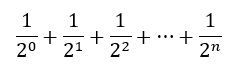

.. index:: accumulator pattern

The Accumulator Pattern Revisited
---------------------------------

Newton's method to calculate square roots is an example of an algorithm that repeats as long as it can improve the result. It's just a variation of our accumulator pattern. Many algorithms work this way and so require the use of indefinite iteration.

Here is another accumulator pattern program. It adds up the reciprocals of powers of two.

You may have studied this sequence in a math class and learned that the sum approaches but never reaches 2.0. That is true in theory. However, when we implement this summation in a program, we see something different. 

.. activecode:: chp07_sum2n

    def sumTo():
        """ Return the sum of reciprocals of powers of 2 """

        theSum  = 0
        aNumber = 0
        while theSum < 2.0:
            theSum = theSum + 1/2**aNumber
            aNumber = aNumber + 1

        return theSum

    print(sumTo())

.. admonition:: Modify the program ...

   If the sum never reaches 2.0, the loop would never terminate. But the loop does stop! How many repetitions did it make before it stopped?

   On line 9 (not indented), print the value of ``aNumber`` and you will see.

   But **why** did it reach 2.0? Are those math teachers wrong?

