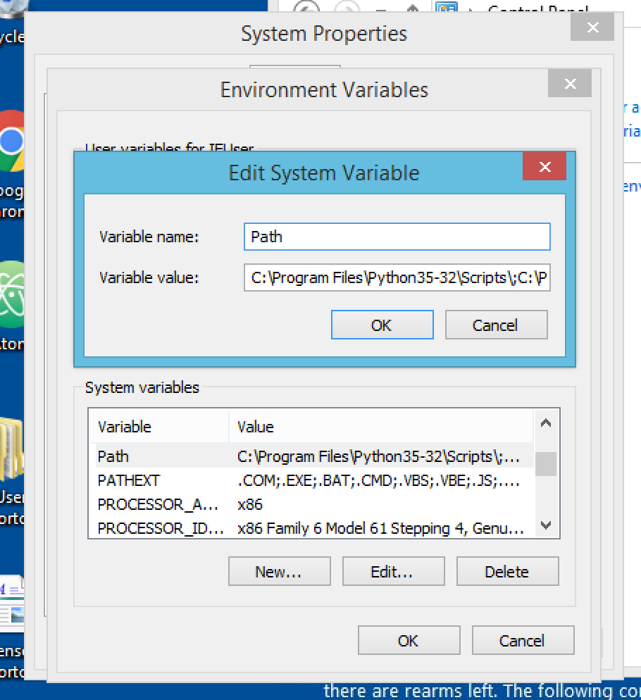
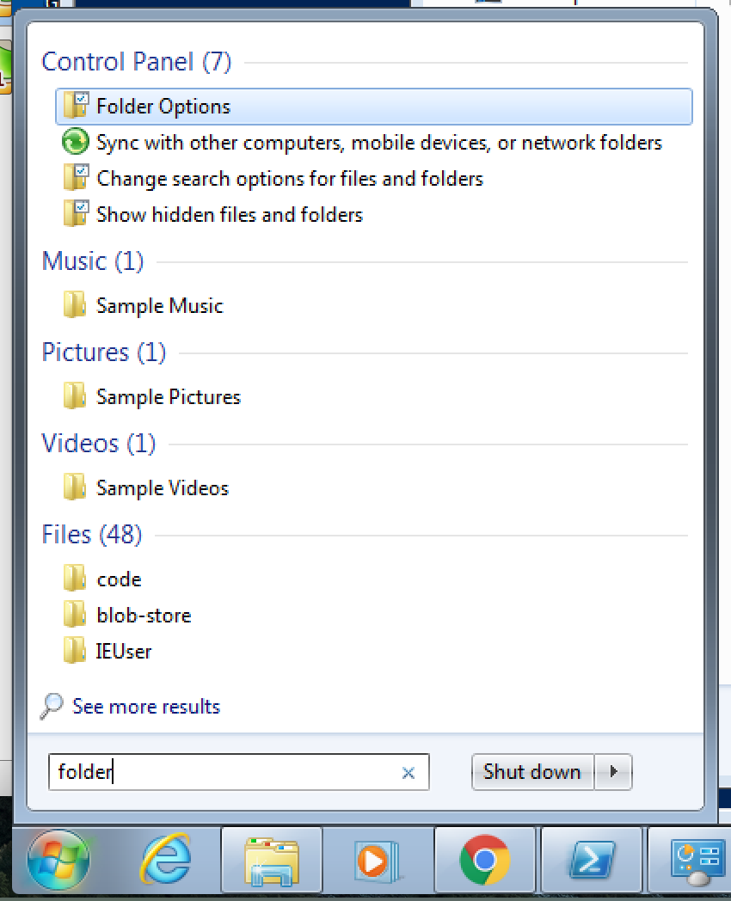

Using Python Locally
--------------------

It's time to do the work to get Python running on your own computer, outside of this book. This will require some setup work, along with learning some new things about your computer, such as how to use a command line interface.

If that sounds intimidating, don't worry. While learning how to use the command line can seem scary, it's not bad at all if you learn it in steps and practice regularly. Before you know it, you'll find interacting with your computer via the command line to be super useful, maybe even fun!

Getting Familiar with the Command Line
======================================

Before we install Python on our computers, let's get familiar with the command line. We're going to use Appendix A from the online book *Learn Python the Hard Way* (don't worry, the book is more approachable than the title makes it it sound). This section is called `Command Line Crash Course`_ and it contains 15 short tutorials teaching you the basics of how to interact with your computer's file system and operating system using a "terminal" or "shell". **Do all 15!**

Installing and Running Python Locally
=====================================

By "locally" we mean that you are now about to install and run python on your computer, as opposed to through some web-based or remote tool. This will be a little different for each operating system, so find the appropriate video below and follow along.

We'll install Atom, a general-purpose code editor, along with *both* Python 2 and Python 3. We've been using Python 3 thus far, but we'll need to use Python 2 a bit later in the class.

Mac OS X
~~~~~~~~

.. raw:: html

    
<iframe width="560" height="315" src="https://www.youtube.com/embed/DZmkImpGSAU" frameborder="0" allowfullscreen></iframe>

Windows
~~~~~~~

This video walks through the details for Windows 10. If you're using Windows 7 or 8, see the notes below on a few things that will be slightly different for you.

*Note: If you have an even older version of Windows, such as Windows Vista or Windows XP, you may have a very different experience getting these tasks going. We encourage you to do some research of your own or work with a fellow student or TF. And after a bit of that, you may be ready to spring for that Windows upgrade!

.. raw:: html

    
<iframe width="560" height="315" src="https://www.youtube.com/embed/zNHqcy6ZguQ" frameborder="0" allowfullscreen></iframe>

**Editing the Path Environment Variable on Windows 7 and 8**

This occurs around 24:30 of the video.

When editing the Path environment variable after installing Python 2, you will see a slightly different dialog.

Rather than the dialog pictured in the video, you'll see the more condensed dialog, shown above. To add Python 2 to your path, you need to manually type in the new location at the end of the existing path. *Be careful not to delete any of the path entries that are already there!*

To the end of the text that is already present in the Path dialog, add (note the semicolon): ``;C:\Python27\``

**Accessing Folder Options in Windows 7**

This occurs around 26:50 of the video.

To access the Folder Options dialog and allow viewing of file extensions, you'll need to do the following:

1. Open the Windows menu at the bottom left and search for "folder options"

2. Open the result named "Folder Options" that is displayed under "Control Panel"

The rest of the process of changing this setting is the same as in the video.

Linux
~~~~~

We walk through the process in Ubuntu 16.04. If you're using a different version of Linux, it may be slightly different, and we encourage you to Google for answers to anything that may not be covered here.

.. raw:: html

    
<iframe width="560" height="315" src="https://www.youtube.com/embed/ypXJ1kwF7s4" frameborder="0" allowfullscreen></iframe>

.. _Command Line Crash Course: http://learnpythonthehardway.org/book/appendixa.html
