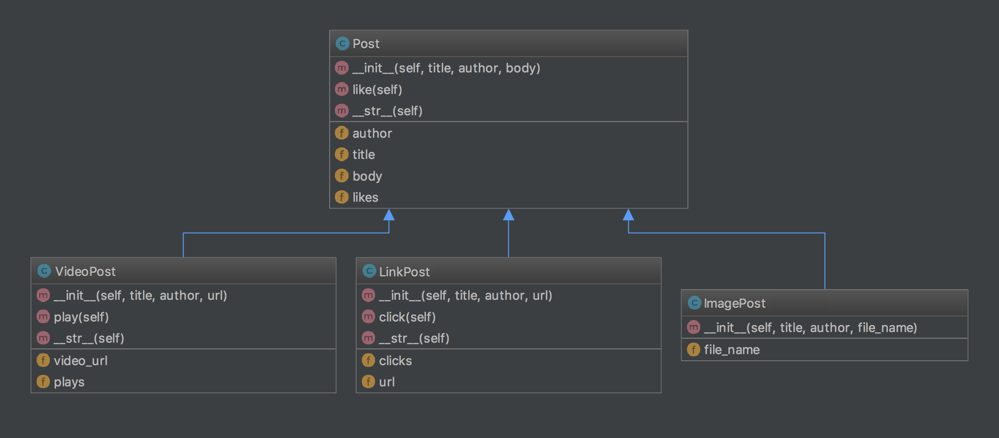

Blog Design
===========

*Studios are in-class activities to give you hands-on practice with new concepts. The first half is the Walkthrough, an instructor-led programming problem. The second half is for you to work on individually or in pairs in class.*

*These problems are not graded, and you are not obligated to finish them. Get as far as you can while in class, and use them as an opportunity to play with and solidify new concepts.*

Walkthrough
-----------

In this walkthrough, we'll build a couple of classes using inheritance. We also introduce the idea of a **class diagram**, which is a method of visually representing classes and the way they relate to each other.

When viewing these class diagrams, there are 4 main components:

1. **Class name** - the class name is at the top of the box representing a given class
2. **Methods** - the methods that the class contains, along with the arguments that each method takes
3. **Fields** - the fields/properties that the class contains (aka, *attributes*)
4. **Inheritance** - an arrow from one class to another indicates that the former class *inherits from* or *extends* the latter class

These class diagrams are special cases of a more general format for representing classes and objects visually, known as **Universal Modeling Languages (UML)**. You can read more about UML at `Wikipedia <https://en.wikipedia.org/wiki/Unified_Modeling_Language>`_.

The code we'll write mimics the idea of a multi-format blog platform, such as Tumblr. We'll model a blog post as a basic entity, but also include multiple different types of posts that have different behavior based on the media that they are presenting. For the walkthrough, we'll build ``Post`` and ``VideoPost`` classes.

.. image:: Figures/ch14-walkthrough.png

.. activecode:: blog_design_walkthrough

    class Post:
        def __init__(self, title, author, body):
            self.title = title
            self.author = author
            self.body = body
            self.likes = 0

        # Allow people to "like" posts, a la Facebook
        def like(self):
            self.likes += 1

        def __str__(self):
            return self.title + " by " + self.author

    class VideoPost(Post):
        def __init__(self, title, author, url):
            Post.__init__(self, title, author, None)
            self.video_url = url
            self.plays = 0

        # track plays of the video
        def play(self):
            self.plays += 1

        def __str__(self):
            return self.title + " played " + str(self.plays) + " times"

    def main():
        plain_post = Post("10 Best Albums of 2016", "Chris Bay", "1. Little Scream - Cult Following 2. ...")
        vid_post = VideoPost("Little Scream - Love As a Weapon", "Chris Bay", "https://youtu.be/Tq4Vw4MB6eA")

        vid_post.play()
        vid_post.play()

        print(vid_post)
        print(plain_post)

    if __name__ == "__main__":
        main()

.. note::

    In the walkthrough, we use the syntax ``Post.__init__(self, [args] )`` to invoke the superclass' constructor. This is totally valid, but isn't the preferred way to do so. A better way is to use ``super().__init__( [args] )``. This is a better method because if your class has multiple parent classes -- that is, it's parent class also has a parent class, and so on -- then *each* of the superclass constructors is invoked in order.

    We use this less-preferred method because the version of Python used in this book doesn't support the preferred method. When using Python in most situations, you'll be able to use the preferred method.

Studio
------

Create two new classes, ``ImagePost`` and ``LinkPost``, based on the class diagram below. The output of your code should match this sample output: ::

    Little Scream - Love As a Weapon played 2 times
    10 Best Albums of 2016 by Chris Bay
    Cats in space by Crystal Martin
    LaunchCode's LC101: https://www.launchcode.org/lc101

.. activecode:: blog_design_studio

    class Post:
        def __init__(self, title, author, body):
            self.title = title
            self.author = author
            self.body = body
            self.likes = 0

        def like(self):
            self.likes += 1

        def __str__(self):
            return self.title + " by " + self.author

    class VideoPost(Post):
        def __init__(self, title, author, url):
            Post.__init__(self, title, author, None)
            self.video_url = url
            self.plays = 0

        def play(self):
            self.plays += 1

        def __str__(self):
            return self.title + " played " + str(self.plays) + " times"

    # TODO - create ImagePost class based on class diagram

    # TODO - create LinkPost class based on class diagram

    plain_post = Post("10 Best Albums of 2016", "Chris Bay", "1. Little Scream - Cult Following 2. ...")
    vid_post = VideoPost("Little Scream - Love As a Weapon", "Chris Bay", "https://youtu.be/Tq4Vw4MB6eA")
    pic_post = ImagePost("Cats in space", "Crystal Martin", "spacecats.gif")
    url_post = LinkPost("LaunchCode's LC101", "LaunchCode Staff", "https://www.launchcode.org/lc101")

    vid_post.play()
    vid_post.play()
    url_post.click()

    print(vid_post)
    print(plain_post)
    print(url_post)
    print(pic_post)
