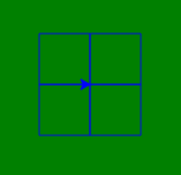

Wagon Wheel
===========

*Studios are in-class activities to give you hands-on practice with new concepts. The first half is the Walkthrough, an instructor-led programming problem. The second half is for you to work on individually or in pairs in class.*

*These problems are not graded, and you are not obligated to finish them. Get as far as you can while in class, and use them as an opportunity to play with and solidify new concepts.*

Walkthrough
-----------

For this walkthrough, we will write a program that uses functions to draw a line star with a chosen number of lines.

.. activecode:: wagon_wheel_walkthrough

    import turtle

    def draw_line(length, angle):
        mike = turtle.Turtle()
        mike.left(angle)
        mike.forward(length / 2)
        mike.forward(-length)
        mike.forward(length / 2)

    def star(lines):
        for angle in range(0, 180, int(180/lines)):
            draw_line(200, angle)

    star(10)

Studio
------

Draw this pretty pattern.

.. image:: Figures/tess08.png

*Hint:* Think about the repeating element that makes up this image. It probably looks a lot like what you'd draw on the sidewalk if you wanted to play foursquare.

.. activecode:: wagon_wheel_studio

Bonus Missions
--------------

1. Modify the ``square`` function given to you in section 5.4 of the textbook. Modify this function so that instead of computing the square, it can compute any positive integer exponent that is given to the function.

.. activecode:: wagon_wheel_studio_bm1

2. The `Fibonacci sequence<https://en.wikipedia.org/wiki/Fibonacci_number>`_ is given as:

0, 1, 1, 2, 3, 5, 8, 13, 21...

Notice that each number in the series is simply the sum of the previous two numbers of the series. Write a function called ``fib(n)`` that takes in an integer ``n`` which is greater than 2 and returns the ``nth`` Fibonacci number. For example ``fib(4)`` would return 3, ``fib(6)`` would return 8 etc. (Hint: Remember that zero-based indexing we talked about...)

Note that it is tricky to compute ``fib(0) = 0`` and ``fib(1) = 1`` with the concepts we have currently covered. If you have done the prep work for chapter 6, however, you should be able to update your function to cover those two values.

Finally, investigate the following question: what is the largest value of ``n`` that returns the correct Fibonacci number? Why does this function stop working after that point?

.. activecode:: wagon_wheel_studio_bm2
