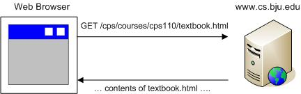

How the Web Works
-----------------

Before learning how to write a web application, you need to understand a bit about how
web browsers work, and how web applications interact with users.

A **web browser**, at its core, is a fairly simple application. Basically, web browsers 

1. Request files from web servers.
    The World-Wide Web is composed of thousands of web servers connected to the Internet. Each web
    server contains lots of different kinds of files that web browsers can request: HTML pages, image
    files, audio files, and other resources. When you click a link on a web page, the web browser sends a
    request to the web server, which transmits the requested file back to the browser.

2. Process the downloaded files appropriately.
    Once the web browser has downloaded the requested file, it needs to do something with it. Web
    browsers know how to render an HTML document, show images, play audio files, and so on. If the
    web browser doesn't know what to do with a file, it usually prompts the user to save the file, so the
    user can do something with it.

Let's take a specific example. Use your browser to access the following URL:

    https://docs.python.org/3/library/index.html

.. note::

    A **URL** ("Uniform Resource Locator") is the address of a resource on the Web. It
    has three sections: the **protocol** (ex. https:) the browser uses to request the resource, 
    the **server** where the document is located (ex.
    ``docs.python.org``), and the **path** to the requested resource on the server (ex. 
    ``/3/library/index.html``).
    
When you click on this link, here's what happens:

1. The browser opens a network connection to the web server named docs.python.org

2. The browser requests a file located on the server at /3/library/index.html 

3. The web server transmits the HTML file back to the browser

4. The browser renders the HTML document    

If you want to see the file transmitted by the web server to the browser, right-click in the browser window
and choose **View Page Source** (your browser's option to view the source may be slightly different). 
The browser shows you the file it downloaded from the web server.

