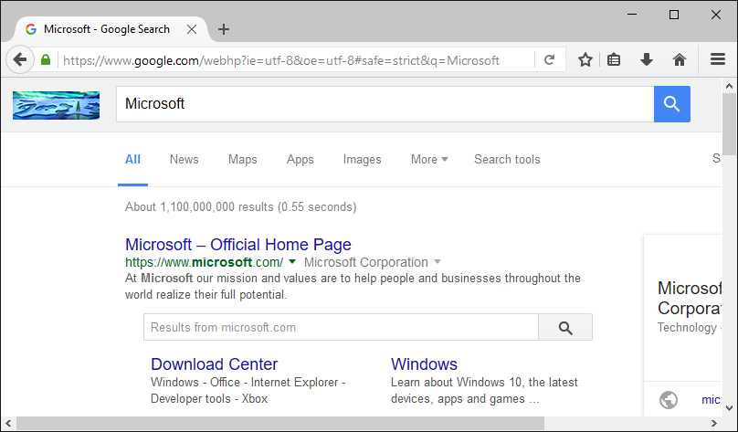

Web Applications and HTML Forms
-------------------------------

Perhaps you're thinking, "I don't usually perform searches by typing in URL's --- I fill out a search form."
True --- if web applications forced users to interact with them by entering query strings, the World-Wide
Web would be a much less popular place.

Let's explore the relationship between forms and query strings a bit. Bring up the Google home page (I'll wait):

  https://google.com

Now, type in your query. When I type in "Microsoft" and click Search, here is what I see:

Now, take a good look at the URL in the title bar --- notice the query string? It's a bit more complicated
than the one I had you create by hand earlier. But you can probably pick out the "q=Microsoft" if you
look closely. How did all of that get there? Well, when you clicked Search, the browser took the information
you typed into the form, packaged it up into a query string, and transmitted it to the Google web
server. You see, when you fill out a form on a web page and click Submit, the browser uses the form
data to construct a URL, and then sends a normal request to the web server.

Even if you're a novice at writing **HTML pages**, it's not hard to learn to create HTML forms. Take a look
at this simplified version of the Google home page:

.. sourcecode:: html
    :emphasize-lines: 8-11
    :linenos:

    <html>
    <head>
        <title>Google</title>
    </head>
    <body>
        

          
        <form action="https://google.com/search">
          Enter your search words: <input type="text" name="q">  
          <input type="submit" name="btnG" value="Google Search">
        </form>
        

    </body>
    </html>
    
Focus on the region of this example in between the <form> tags. Here's a quick overview of this part
of the page:

* The form is the region of the page in between the <form> and </form> tags.

* The form can contain a mixture of text, regular HTML formatting tags, and form <input> tags

* Each ``<input>`` tag has a ``type`` and a ``name`` attribute. The ``type`` attribute specifies what kind of input area
  it is ("text" for a text box, "submit" for submit button, etc.). The ``name`` attribute specifies a name for
  the input area.
  
* When the user fills out the form and clicks the submit button, the browser constructs a URL by taking
  the form's ``action`` attribute (https://google.com/search), appending a ?, and constructing the
  query string using the names of the form input areas, together with the data entered by the user.

Try it out! Using Notepad, type in this example, and save it as googleform.html. Open it in your browser;
you should see something like this:    

Fill out the form, and, if Google still works as it did when this chapter was written, you should see
search results appear in your browser.

For more information about creating HTML forms, you might take a look at the excellent 
`tutorial at w3schools.com <https://www.w3schools.com/html/html_forms.asp>`_.