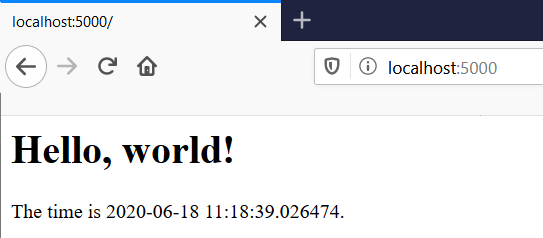

Writing Web Applications With Flask
------------------------------------

In this section, you will learn how to write web applications using a Python framework 
called Flask.

Here is an example of a Flask web application:

.. sourcecode:: python
   :linenos:
   
    from flask import Flask
    from datetime import datetime
    
    app = Flask(__name__)
    
    @app.route('/')
    def hello():
        return """<html><body>
            <h1>Hello, world!</h1>
            The time is """ + str(datetime.now()) + """.
            </body></html>"""

    if __name__ == "__main__":
        # Launch the Flask dev server 
        app.run(host="localhost", debug=True)

The application begins by importing the Flask framework on line 1. Lines 6-11 define a function ``hello()``
that serves up a simple web page containing the date and time. The call to ``app.run()`` on Line 14 
starts a small web server. The ``run()`` method
does not return; it executes an infinite loop that waits for incoming requests from web browsers.
When a web browser sends a request to the Flask web server, the server invokes the ``hello()`` function
and returns the HTML code generated by the function to the web browser, which displays the result.

To see this in action, copy the code above into a text editor and save it as flaskhello.py (or whatever
name you like). Then, download the Flask framework and install it on your computer. In many cases,
you can accomplish this using the pip command included with your Python distribution::

    pip install flask
    
Next, execute your flaskhello.py program from the command line::

    python flaskhello.py

.. note:: 

    If you are using a Mac or Linux computer, use the following command to install flask::

        pip3 install flask

    and execute your flaskhello.py program using the following command::

        python3 flaskhello.py
    
When you launch the program, you should see a message similar to the following appear on the console::

    * Serving Flask app "sample" (lazy loading)
    * Environment: production
    WARNING: Do not use the development server in a production environment.
    Use a production WSGI server instead.
    * Debug mode: on
    * Restarting with stat
    * Debugger is active!
    * Debugger PIN: 244-727-575
    * Running on http://localhost:5000/ (Press CTRL+C to quit)
    
.. note::    

    If you get an error message of some sort, it is possible that your computer
    may be running a server application that is using the port number that
    Flask wants to use. See the next
    section, "More About Flask," for a discussion of port numbers and how
    to address this issue.
    
Once the Flask server is running, use your browser to navigate to the following URL:

    http://localhost:5000/

Your browser sends a request to the Flask server, and you should see a "Hello, world!" message appear:

To send the request again, press the Reload button in your browser. You should
see the date and time change.

