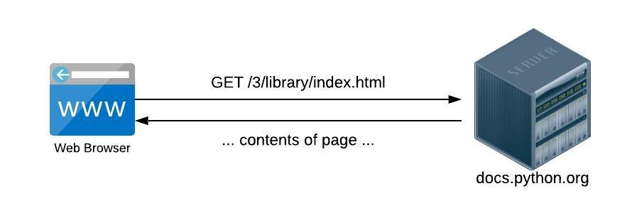
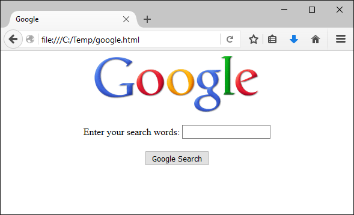

..  Copyright (C)  Stephen Schaub.  Permission is granted to copy, distribute
    and/or modify this document under the terms of the GNU Free Documentation
    License, Version 1.3 or any later version published by the Free Software
    Foundation; with Invariant Sections being Forward, Prefaces, and
    Contributor List, no Front-Cover Texts, and no Back-Cover Texts.  A copy of
    the license is included in the section entitled "GNU Free Documentation
    License".

.. index:: web applications

Web Applications
----------------

In this chapter, you will learn how to create web applications in Python. There are two kinds of web
applications -- "client side" web applications and "server side" web applications. You've probably used
both kinds in your travels on the World-Wide Web.

* Client-side web applications are programs that are downloaded to a web browser and executed on
  the user's local machine. Client-side applications are typically written in JavaScript and embedded
  in web pages. 

* Server-side web applications are programs that run on web server computers, rather than on the
  user's local machine. Typically, a server-side web application displays a form with text boxes and
  other data collection mechanisms. The user fills out the form, clicks a submit button, and the
  browser sends the form to the web application on the server, which processes the request, and responds
  with another web page. If you've ever shopped online, you've used a server-side web application.

In this chapter, you will learn to build server-side web applications, which I will refer to simply as "web
applications."

How the Web Works
-----------------

Before learning how to write a web application, you need to understand a bit about how
web browsers work, and how web applications interact with users.

A web browser, at its core, is a fairly simple application. Basically, web browsers 

1. Request files from web servers.
    The World-Wide Web is composed of thousands of web servers connected to the Internet. Each web
    server contains lots of different kinds of files that web browsers can request: HTML pages, image
    files, audio files, and other resources. When you click a link on a web page, the web browser sends a
    request to the web server, which transmits the requested file back to the browser.

2. Process the downloaded files appropriately.
    Once the web browser has downloaded the requested file, it needs to do something with it. Web
    browsers know how to render an HTML document, show images, play audio files, and so on. If the
    web browser doesn't know what to do with a file, it usually prompts the user to save the file, so the
    user can do something with it.

Let's take a specific example. Start up your browser and type in the following URL:

http://cs.bju.edu/cps/courses/cps110/textbook.html

.. note::

    A URL ("Uniform Resource Locator") is the address of a document on the Web. It
    has three sections: the protocol (ex. http:), the server where the document is located (ex.
    www.cs.bju.edu), and the path to the requested resource on the server (ex. 
    /cps/courses/cps110/textbook.html).
    
When you press Enter, here's what happens:

1. The browser opens a network connection to the web server named cs.bju.edu

2. The browser requests the file /cps/courses/cps110/textbook.html from the web server

3. The web server transmits the HTML file back to the browser

4. The browser renders the HTML document    

If you want to see the file transmitted by the web server to the browser, right-click in the browser window
and choose **View Page Source** (your browser's option to view the source may be slightly different). 
The browser shows you the file it downloaded from the web server.

How Web Applications Work
-------------------------

Most of the time, when your browser requests a file from a web server, the server simply transmits the
contents of the file back to the browser. But sometimes, the "file" your browser requests isn't really a file
at all.

Try typing the following URL into your browser:

http://google.com/search?q=Microsoft

You'll get back a page of search results about Microsoft from the Google search engine (at least, you
will unless Google has changed how it performs searches since the time I wrote this chapter). How did
this happen?

Well, your browser did what it always does when you type in a URL:

1. The browser opened a network connection to the web server named google.com

2. The browser requested the "file" named /search?q=Microsoft from the web server

3. What the web server did at this point is different than the example above. 
   There's no "file" named "/search?q=Microsoft" on the Google web server. 
   Instead, the web server ran a web application to
   search through Google's massive database of websites for pages that mention "Microsoft". The web
   application dynamically generated an HTML document containing the search results, and the web
   server transmitted that document back to the browser.
   
4. The browser rendered the HTML document

As far as your browser is concerned, there is no difference between requesting a "static" HTML file
from a web server, and requesting a dynamically generated HTML file. It's up to the web server to examine
the request submitted by the web browser to determine whether it should serve up a regular document,
or run a web application to generate a response.

Anytime you're browsing the web, and you notice that the URL of the page you're viewing has a question
mark (?), you can be fairly certain that the page was generated "on the fly" by a web application on
a web server. By the way, the portion of the URL that comes after the ? is called the "query string," and
contains input for the web application. Try changing the query string by substituting "Firefox" for "Microsoft"
to see what I mean.

In summary, a (server-side) web application is a program that is run by a web server to produce output
in response to an incoming request from a web browser.

Web Applications and HTML Forms
-------------------------------

Perhaps you're thinking, "I don't usually perform searches by typing in URL's -- I fill out a search form."
True -- if web applications forced users to interact with them by entering query strings, the World-Wide
Web would be a much less popular place.

So go ahead -- bring up the Google home page (I'll wait):

http://google.com

Now, type in your query. When I type in "Microsoft" and click Search, here is what I see:

.. image:: Figures/googlesearchresults.png

Now, take a good look at the URL in the title bar -- notice the query string? It's a bit more complicated
than the one I had you create by hand earlier. But you can probably pick out the "q=Microsoft" if you
look closely. How did all of that get there? Well, when you clicked Search, the browser took the information
you typed into the form, packaged it up into a query string, and transmitted it to the Google web
server. You see, when you fill out a form on a web page and click Submit, the browser uses the form
data to construct a URL, and then sends a normal request to the web server.

Even if you're a novice at writing HTML pages, it's not hard to learn to create HTML forms. Take a look
at this simplified version of the Google home page:

.. sourcecode:: html
    :emphasize-lines: 8-11
    :linenos:

    <html>
    <head>
        <title>Google</title>
    </head>
    <body>
        

          
        <form action="http://google.com/search">
          Enter your search words: <input type="text" name="q">  
          <input type="submit" name="btnG" value="Google Search">
        </form>
        

    </body>
    </html>
    
Focus on the region of this example in between the <form> tags. Here's a quick overview of this part
of the page:

* The form is the region of the page in between the <form> and </form> tags.

* The form can contain a mixture of text, regular HTML formatting tags, and form <input> tags

* Each <input> tag has a type and a name attribute. The type attribute specifies what kind of input area
  it is ("text" for a text box, "submit" for submit button, etc.). The name attribute specifies a name for
  the input area.
  
* When the user fills out the form and clicks the submit button, the browser constructs a URL by taking
  the form's action attribute (http://www.google.com/search), appending a ?, and constructing the
  query string using the names of the form input areas, together with the data entered by the user.

Try it out! Using Notepad, type in this example, and save as googleform.html. Open it in your browser;
you should see something like this:    

Fill out the form, and, if Google still works as it did when this chapter was written, you should see
search results appear in your browser.

Writing Web Applications With Bottle
------------------------------------

In this section, you will learn how to write web applications using a Python framework 
called Bottle.

Here is an example of a Bottle web application:

.. sourcecode:: python
   :linenos:
   
    import bottle
    from datetime import datetime

    @bottle.route('/')
    def hello():
        return """<html><body>
            <h1>Hello, world!</h1>
            The time is {0}.</body></html>""".format(
                str(datetime.now()))

    # Launch the BottlePy dev server 
    bottle.run(host='localhost', debug=True)

The application begins by importing the bottle framework on line 1. Lines 4-9 define a function ``hello()``
that serves up a simple web page containing the date and time. The call to ``bottle.run()`` on Line 12 
starts a small web server. The ``run()`` method
does not return; it executes an infinite loop that waits for incoming requests from web browsers.
When a web browser sends a request to the bottle web server, the server invokes the ``hello()`` function
and returns the HTML code generated by the function to the web browser, which displays the result.

To see this in action, copy the code above into a text editor and save it as bottlehello.py (or whatever
name you like). Then, download the Bottle framework and install it on your computer. In many cases,
you can accomplish this using the pip command included with your Python distribution::

    pip install bottle
    
If that doesn't work, you can download the Bottle framework from bottlepy.org. It consists
of a single Python script, bottle.py. Place that script in the same folder as your 
bottlehello.py program.

Next, execute your bottlehello.py program from the command line::

    python bottlehello.py
    
You should see a message similar to the following appear on the console::

    Bottle v0.12.9 server starting up (using WSGIRefServer())...
    Listening on http://localhost:8080/
    Hit Ctrl-C to quit.
    
    
.. note::    

    If you get an error message of some sort, it is possible that your computer
    may be running a server application that is using the port number that
    Bottle wants to use. See the next
    section, "More About Bottle," for a discussion of port numbers and how
    to address this issue.
    
Once the Bottle server is running, open a web browser and enter the following URL:

http://localhost:8080/
    
You should see a "Hello, world!" message appear:

To send the request again, press the Reload button in your browser. You should
see the date and time change.

More About Bottle
-----------------

When you executed the bottlehello.py program in the previous section and used a web
browser to access it with the url http://localhost:8080/, in addition to seeing a
"Hello, world!" message in the browser, you should also have observed a log message like 
the following in the console::

    127.0.0.1 - - [21/Apr/2016 08:02:28] "GET / HTTP/1.1" 200 25
    
Every time the bottle server receives a request from a browser, it writes a log message to the
console. The message contains information such as the IP address of the computer that sent the request
(127.0.0.1 is a special address indicating the request came from the browser on the same
computer that the bottle server is running on);
the date and time of the request; the path of the incoming request ("/" in this case); and the status
of the result (here, 200 indicates the request was successfully processed).

The bottle server continues running until you press Ctrl-C to stop it. At that point, if you
try to send a request to the application from the browser, the browser will display an
error message indicating that it cannot contact the server. Go ahead and try this, so you can
recognize what the error message looks like in your particular browser.
    
Recall that every URL has at least three components: the protocol, server, and the path. In our
case the URL http://localhost:8080/ has the server name *localhost*, the path */*, and 
an additional component: the port number, *8080*. Let's discuss some details about each of these.

Server name 
    When you use the name *localhost* in a URL, the browser attempts to connect to
    a server program running on your computer. This is the usual scenario when you are developing
    a web application: the browser and the server application are both running on the same computer.
    Later, when you deploy the application to be hosted on an actual server, you will use the name
    of the server in the URL instead of the name *localhost*.

Port number
    Each server application running on
    a computer is assigned a distinct port number so that clients can connect to it. Port numbers
    range from 0 to 65,535. Web servers generally are assigned port number 80, and when the URL
    does not contain a port number, the web browser attempts to connect to a web server listening
    on port 80. But the default port number for Bottle applications is 8080, so the URL must
    include that port number. You can specify a different port number for your Bottle application
    in the line that launches the Bottle server like this::

        bottle.run(port=5000, debug=True)
    
    Here, the Bottle server binds to port 5000, and you would need to use that port number
    instead of 8080 in the URL in the browser.

Path
    When the Bottle receives an incoming request, it examines the path and uses it to determine 
    which function in your program should be executed to handle the request and generate a response.
    A Bottle application can contain one or more of these request handler functions, which are
    decorated by a line immediately preceding the function that looks like this::

        @bottle.route('/')

    The path in the quotes is matched to the path of the incoming request from the browser.
    If the incoming path from the browser does not match any of the handler function paths
    defined by ``@bottle.route()`` decorators,
    an error occurs. For example, try entering the following URL into your browser when the
    bottlehello.py program in the last section is running:
    
        http://localhost:8080/blah
        
    You will see an error message appear in the browser, and the log message that appears
    in the console will have the number 404 after the path, indicating that the path
    did not match, as shown below::
    
        127.0.0.1 - - [21/Apr/2016 08:02:51] "GET /blah HTTP/1.1" 404 720

Here's another version of the bottlehello.py program that has two different
pages. The first page displays a "Hello world" message and invites the user to
click a link to view the time. When the user clicks the link, the time appears.

.. sourcecode:: python
   :linenos:
   
    import bottle
    from datetime import datetime

    @bottle.route('/')
    def hello():
        return """
            <html><body>
                <h1>Hello, world!</h1>
                Click <a href="/time">here</a> for the time.
            </body></html>
            """

    @bottle.route('/time')
    def time():
        return """
            <html><body>
                The time is {0}.
            </body></html>
            """.format(str(datetime.now()))

    # Launch the BottlePy dev server 
    bottle.run(host='localhost',debug=True)

Here's how it works:

1. To begin, the user enters the URL http://localhost:8080, and the browser sends
   the request to the application. The Bottle server matches that path "/" to the 
   hello() function, invokes the function and returns the response to the browser.
   
2. The user clicks the link, which triggers the browser to send a request with
   the URL http://localhost:8080/time to the Bottle server. The server matches the
   path "/time" to the time() function, invokes the function and returns a response
   containing the time to the browser.
   
Note that the user does not have to click the link in order to display the time. For
example, the user could enter the URL http://localhost:8080/time directly into the
browser to bypass the greeting page and get directly to the page showing the time.

The format() function
---------------------

Here we discuss the format() function.

Input For A Bottle Web Application 
----------------------------------

In this section, we will design a web application that obtains input from
the user. In the example in this section, the user must encode the input directly
into the URL. In the next section, we'll provide a more user-friendly approach
for obtaining input.

The URL used to interact with a web application can contain input data in addition to the
path. This input data is typically encoded into the URL in the form of a query string.
Here's an example of a URL containing a query string:

    http://www.bing.com/search?q=python&go=Submit

The query string is the portion that comes after the ? symbol::

    q=python&go=Submit

It contains a set of query variables and values, each query variable/value pair separated 
from the others by the & symbol. This example has a query variable named ``q`` whose value is
*python+bottle*, and a variable named ``go`` whose value is *Submit*.

Bottle applications can access query variables using a dictionary named
bottle.request.params (dictionaries are discussed in detail in 
:doc:`../Dictionaries/intro-Dictionaries`). 
When a browser sends a request to a Bottle application that contains
a query string, the data in the query string is placed in the bottle.request.params
dictionary, where it can be retrieved by the application. For example, in the Bing search
URL above, if Bing were a Bottle application, it could access the values in the query string 
like this::

    q = bottle.request.params['q']
    go = bottle.request.params['go']
    
This would retrieve the values 'bottle' and 'Submit' from the query string and store them,
respectively, in ``q`` and ``go``.

Here is an ehanced version of the original bottlehello.py program that gets the user's name
from the query string and uses it to greet the user:

.. sourcecode:: python
   :linenos:

    import bottle
    from datetime import datetime

    @bottle.route('/')
    def hello():
        name = bottle.request.params['name']
        return """
            <html><body>
                <h1>Hello, {0}!</h1>
                The time is {1}.
            </body></html>
            """.format(
                name, str(datetime.now()))

    # Launch the BottlePy dev server 
    bottle.run(host='localhost', debug=True)

To test this example, you would need to enter the following URL into the browser:

    http://localhost:8080/?name=Frank
    
If the name parameter is omitted, the application will crash when it attempts to
retrieve the query parameter from the dictionary, because indexing a dictionary
with a key that is not present in the dictionary is illegal. 
To make the application more robust, we could
change line 6 to use the dictionary ``get()`` method, which allows us
to supply a default value to use in case the user omits the query parameter::

    name = bottle.request.params.get('name', 'World')

Web Applications With a User Interface
--------------------------------------

This section builds on the material in the preceding sections to present a web 
application that prompts the user to provide input, performs some processing,
and displays results. 

.. sourcecode:: python
   :linenos:

    import bottle
    from datetime import datetime

    @bottle.route('/')
    def home():
        return """
            <html><body>
                <h2>Welcome to the Greeter</h2>
                <form action="/greet">
                    What's your name? <input type='text' name='username'> 
                    What's your favorite food? <input type='text' name='favfood'> 
                    <input type='submit' value='Continue'>
                </form>
            </body></html>
            """

    @bottle.route('/greet')
    def greet():
        username = bottle.request.params.get('username', 'World')
        favfood = bottle.request.params['favfood']
        if favfood == '':
            msg = 'You did not tell me your favorite food.'
        else:
            msg = 'I like ' + favfood + ', too.'
            
        return """
            <html><body>
                <h2>Hello, {0}!</h2>
                {1}
            </body></html>
            """.format(username, msg)

    # Launch the BottlePy dev server 
    bottle.run(host='localhost',debug=True)
    
The program is organized as follows:

* Lines 4-15 define the ``home()`` function, which defines the starting page for
  the application. It displays a form that prompts for the user's
  name and favorite food.
  
* The form's action attribute on Line 9 specifies that the form submission will be directed
  to the path **/greet**. Processing for this path is defined by the ``greet()`` 
  function on lines 17-31.
  
* Lines 19-26 extract the information submitted on the form and compute a 
  response message.
  
  